# NiftyShield — Architecture (C4 Container, Level 2)

> Answers "what calls what?" without reading `CONTEXT_TREE.md`.
> Rendered natively by GitHub Markdown (Mermaid).

```mermaid
graph TD
    %% ── External systems ──────────────────────────────────────────────
    UPSTOX["☁ Upstox API\n(Analytics + OAuth tokens)\nLTP · option chain · Greeks"]
    DHAN_API["☁ Dhan API\n(holdings · positions\n· fund limit)"]
    NUVAMA_SDK["☁ Nuvama SDK\n(APIConnect)\nbonds · options positions"]
    TELEGRAM["☁ Telegram Bot API\nfire-and-forget alerts"]
    AMFI["☁ AMFI Flat File\nMF NAV source"]
    NSE_FILES["☁ NSE\nbhavcopy downloads\noption chain CSVs"]

    %% ── Data stores ───────────────────────────────────────────────────
    SQLITE[("🗄 portfolio.sqlite\nportfolio · paper trades\nnuvama · dhan · intraday\nsnapshots")]
    PARQUET[("🗄 Parquet files\ndata/historical/ohlc/india_vix/\ndata/offline/options_ohlcv/")]
    BOD[("🗄 NSE.json.gz\nBeginning-of-Day\ninstrument master")]

    %% ── src/client ────────────────────────────────────────────────────
    subgraph CLIENT["src/client/"]
        direction TB
        PROTOCOL["protocol.py\nBrokerClient protocol\n(MarketDataProvider · OrderExecutor\n· PortfolioReader)"]
        UPSTOX_LIVE["upstox_live.py\nUpstoxLiveClient"]
        UPSTOX_MARKET["upstox_market.py\nV3 LTP · option chain"]
        MOCK["mock_client.py\nMockBrokerClient (test)"]
        FACTORY["factory.py ← composition root\ncreate_client(env)"]
        EXCEPTIONS["exceptions.py\nBrokerError hierarchy"]
    end

    %% ── src/auth ──────────────────────────────────────────────────────
    subgraph AUTH["src/auth/"]
        UPSTOX_AUTH["login.py + verify.py\nOAuth flow (browser)"]
        NUVAMA_AUTH["nuvama_login.py + verify.py\nAPIConnect session"]
        DHAN_AUTH["dhan_login.py + verify.py\nmanual token flow"]
    end

    %% ── src/portfolio ─────────────────────────────────────────────────
    subgraph PORTFOLIO["src/portfolio/"]
        PORT_STORE["store.py\nstrategies · legs\ndaily_snapshots · trades"]
        PORT_TRACKER["tracker.py\nPortfolioTracker\nLTP fetch → snapshot"]
        PORT_SUMMARY["summary.py\npure cross-source aggregation"]
        PORT_FORMAT["formatting.py\npure Telegram formatting"]
        STRATEGIES["strategies/\nfinideas_ilts · finrakshak"]
    end

    %% ── src/paper ─────────────────────────────────────────────────────
    subgraph PAPER["src/paper/"]
        PAPER_STORE["store.py\nPaperStore\npaper_trades · nav_snapshots\nleg_snapshots"]
        PAPER_TRACKER["tracker.py\nPaperTracker P&L"]
        PAPER_OVERLAY["overlay_selector.py\nbest expiry selector"]
        PAPER_METRICS["metrics.py\nNEE · cost attribution"]
        PAPER_PROXY["proxy_monitor.py\nTrack C delta drift"]
        TRACK_SNAP["track_snapshot.py\n3-track daily output"]
    end

    %% ── src/risk ──────────────────────────────────────────────────────
    subgraph RISK["src/risk/"]
        RISK_MODELS["models.py\nPortfolioDelta (frozen)"]
        RISK_TRACKER["delta_tracker.py\naggregate_delta()"]
        RISK_GATE["entry_gate.py\ncheck_entry_allowed()"]
    end

    %% ── src/backtest ──────────────────────────────────────────────────
    subgraph BACKTEST["src/backtest/"]
        IVR["ivr.py\ncompute_ivr() IVR 252-day"]
        VIX_INGEST["vix_ingest.py\nIndia VIX ingestion pipeline"]
        CHAIN_WRITER["chain_writer.py\nEOD + intraday Parquet writes"]
        CHAIN_READER["chain_reader.py\nDuckDB chain scan queries"]
        BHAVCOPY["bhavcopy_ingest.py\nbhavcopy_loader.py\nNSE F&O OHLCV"]
    end

    %% ── src/mf ────────────────────────────────────────────────────────
    subgraph MF["src/mf/"]
        MF_STORE["store.py\nmf_transactions\nnav_snapshots"]
        MF_FETCHER["nav_fetcher.py\nAMFI flat file parse"]
        MF_TRACKER["tracker.py\nMFTracker → PortfolioPnL"]
    end

    %% ── src/dhan ──────────────────────────────────────────────────────
    subgraph DHAN["src/dhan/"]
        DHAN_READER["reader.py\nholdings · LTP enrich\n(prefers Upstox batch)"]
        DHAN_POSITIONS["positions.py\noptions positions · charges"]
        DHAN_STORE["store.py\ndhan_holdings_snapshots"]
    end

    %% ── src/nuvama ────────────────────────────────────────────────────
    subgraph NUVAMA["src/nuvama/"]
        NUV_READER["reader.py\nbond holdings parse"]
        NUV_OPTIONS["options_reader.py\noptions positions parse"]
        NUV_STORE["store.py\nbond · options · intraday\nsnapshots"]
        NUV_PROTOCOL["protocol.py\nNuvamaClient protocol"]
        NUV_MOCK["mock_client.py\noffline NuvamaClient"]
    end

    %% ── src/instruments ───────────────────────────────────────────────
    subgraph INSTRUMENTS["src/instruments/"]
        LOOKUP["lookup.py\noffline BOD search\nexact › prefix › fuzzy"]
        LOT_SIZE["lot_size.py\nDateAwareLotSizeResolver"]
        EXPIRY["lookup.py\nget_expiry_candidates()\nmonthly/quarterly/yearly buckets"]
    end

    %% ── Smaller src/ modules ──────────────────────────────────────────
    subgraph OTHER_SRC["src/ — supporting modules"]
        NOTIFICATIONS["notifications/\nTelegramNotifier\nfire-and-forget HTML"]
        MODELS["models/\nLeg · Trade · DailySnapshot\nPortfolioSummary · MFHolding\n(shared Pydantic/dataclass)"]
        MARKET_CAL["market_calendar/\nis_trading_day()\nprev_trading_day()"]
        INTRADAY_STORE["intraday/market_store.py\nIntradayMarketStore\nnifty_spot + vix ticks"]
        UTILS["utils/\nnumber_formatting.py\nfmt_inr() Indian numbering"]
        DB["db.py\nshared SQLite context mgr\nWAL · FK · auto-commit"]
        GAMMA["gamma/\nNear-Expiry Gamma Buy\nGammaStore scaffolding"]
        CONFIG["src/config.py\nSettings (pydantic-settings)\nenv var singleton — planned CH-7a"]
    end

    %% ── scripts/ ──────────────────────────────────────────────────────
    subgraph SCRIPTS["scripts/"]
        EOD["daily_snapshot.py\nEOD P&L · Telegram"]
        MORNING["morning_nav.py\nMF NAV backfill (09:15)"]
        INTRADAY_CRON["intraday_tracker.py\nDhan+Nuvama 5-min cron"]
        PAPER_SNAP["paper_3track_snapshot.py\n3-track EOD cron (15:45)"]
        PAPER_OVERLAY_SCRIPT["paper_3track_overlay.py\noverlay entry (PP/CC/collar)"]
        PAPER_ROLL["paper_3track_overlay_roll.py\nroll at DTE ≤ 5"]
        RECORD["record_paper_trade.py\nrecord_trade.py\nroll_leg.py"]
        FIND_STRIKE["find_strike_by_delta.py\nlive chain → |delta| filter"]
        BHAVCOPY_BOOT["bhavcopy_bootstrap.py\nbulk NSE bhavcopy download"]
        HEALTHCHECK["scripts/healthcheck.py\n6-check dead man's switch\nplanned CH-8"]
    end

    %% ── Dependency edges ──────────────────────────────────────────────

    %% auth → external
    UPSTOX_AUTH --> UPSTOX
    NUVAMA_AUTH --> NUVAMA_SDK
    DHAN_AUTH --> DHAN_API

    %% client internals
    FACTORY --> UPSTOX_LIVE
    FACTORY --> MOCK
    UPSTOX_LIVE --> UPSTOX_MARKET
    UPSTOX_MARKET --> UPSTOX
    UPSTOX_LIVE --> EXCEPTIONS

    %% portfolio → client + db
    PORT_TRACKER --> FACTORY
    PORT_TRACKER --> PORT_STORE
    PORT_TRACKER --> MODELS
    PORT_STORE --> DB
    DB --> SQLITE
    PORT_SUMMARY --> MODELS
    PORT_FORMAT --> PORT_SUMMARY

    %% paper → client + instruments + db + backtest
    PAPER_TRACKER --> FACTORY
    PAPER_TRACKER --> PAPER_STORE
    PAPER_STORE --> DB
    PAPER_OVERLAY --> FACTORY
    TRACK_SNAP --> PAPER_TRACKER
    TRACK_SNAP --> PAPER_STORE

    %% paper uses instruments for expiry lookup
    PAPER_OVERLAY --> EXPIRY
    FIND_STRIKE --> EXPIRY

    %% paper uses backtest for IVR
    PAPER_TRACKER --> IVR
    IVR --> PARQUET

    %% risk reads paper positions
    RISK_TRACKER --> PAPER_STORE
    RISK_GATE --> RISK_TRACKER

    %% backtest → external + parquet
    VIX_INGEST --> UPSTOX
    VIX_INGEST --> NSE_FILES
    VIX_INGEST --> PARQUET
    CHAIN_WRITER --> PARQUET
    CHAIN_READER --> PARQUET
    BHAVCOPY --> NSE_FILES
    BHAVCOPY --> PARQUET

    %% mf → amfi + db
    MF_FETCHER --> AMFI
    MF_TRACKER --> MF_STORE
    MF_TRACKER --> MF_FETCHER
    MF_STORE --> DB

    %% dhan → dhan api + upstox (LTP) + db
    DHAN_READER --> DHAN_API
    DHAN_READER --> FACTORY
    DHAN_POSITIONS --> DHAN_API
    DHAN_STORE --> DB

    %% nuvama → sdk + db
    NUV_READER --> NUV_PROTOCOL
    NUV_OPTIONS --> NUV_PROTOCOL
    NUV_PROTOCOL -.->|implements| NUVAMA_SDK
    NUV_STORE --> DB
    INTRADAY_STORE --> DB

    %% instruments → BOD file
    LOOKUP --> BOD
    EXPIRY --> BOD

    %% notifications → telegram
    NOTIFICATIONS --> TELEGRAM

    %% scripts orchestrate src/
    EOD --> PORT_TRACKER
    EOD --> MF_TRACKER
    EOD --> DHAN_READER
    EOD --> NUV_READER
    EOD --> PORT_SUMMARY
    EOD --> PORT_FORMAT
    EOD --> NOTIFICATIONS
    EOD --> MARKET_CAL

    MORNING --> MF_TRACKER
    MORNING --> MARKET_CAL

    INTRADAY_CRON --> NUV_OPTIONS
    INTRADAY_CRON --> DHAN_POSITIONS
    INTRADAY_CRON --> INTRADAY_STORE
    INTRADAY_CRON --> FACTORY
    INTRADAY_CRON --> MARKET_CAL

    PAPER_SNAP --> TRACK_SNAP
    PAPER_SNAP --> NOTIFICATIONS
    PAPER_SNAP --> MARKET_CAL

    PAPER_OVERLAY_SCRIPT --> PAPER_STORE
    PAPER_OVERLAY_SCRIPT --> PAPER_OVERLAY
    PAPER_OVERLAY_SCRIPT --> FACTORY

    PAPER_ROLL --> PAPER_STORE
    PAPER_ROLL --> PAPER_OVERLAY

    RECORD --> PAPER_STORE
    RECORD --> FACTORY
    RECORD --> LOOKUP

    FIND_STRIKE --> FACTORY
    BHAVCOPY_BOOT --> NSE_FILES
```

## Legend

| Shape | Meaning |
|-------|---------|
| Rounded box | `src/` module or script |
| Cloud `☁` | External system (network call required) |
| Cylinder `🗄` | Persistent data store |
| Subgraph | Package boundary |
| Solid arrow `-->` | Runtime dependency / call direction |
| Dashed arrow `-.->` | Protocol implementation |

## Key invariants

- **`src/client/factory.py`** is the sole composition root. Every module that needs a broker call receives a `BrokerClient` instance injected via constructor — never imports `UpstoxLiveClient` directly.
- **`src/db.py`** is the single SQLite connection manager. All modules share one `portfolio.sqlite` file; table isolation is by name prefix (`paper_*`, `nuvama_*`, `dhan_*`).
- **`src/models/`** contains all cross-module Pydantic/dataclass types (`Leg`, `Trade`, `PortfolioSummary`, `MFHolding`). Modules import from here; they do not define their own shared types.
- **Monetary fields** are always `Decimal`, stored as `TEXT` in SQLite. Floats from external APIs are coerced at the boundary via `Decimal(str(value))`.
- **Timestamps** stored as UTC; converted to IST only at display layer.
- **`src/notifications/`** is non-fatal: `send()` never raises; `build_notifier()` returns `None` when credentials are absent.
