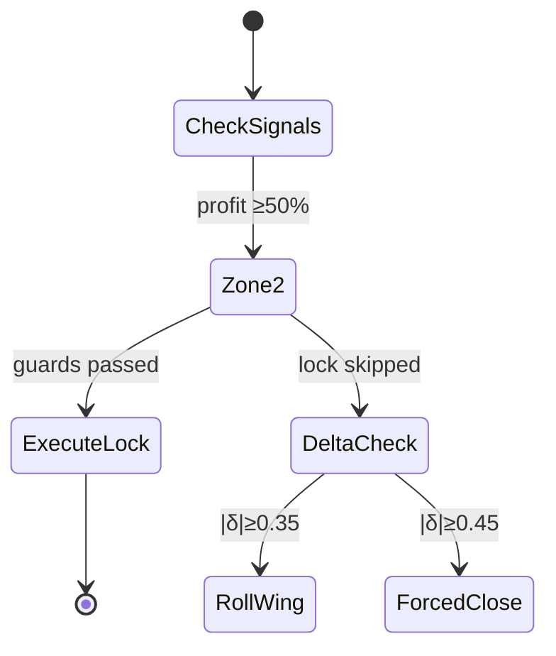

# Council Decision: ic-v2-profit-lock-adjustment

Date: 2026-06-27  
Chairman: anthropic/claude-4.6-opus-20260205  
Council members: openai/gpt-5.5-20260423, openai/o3-2025-04-16, x-ai/grok-4.3-20260430, deepseek/deepseek-r1-0528

---

## Stage 3 — Chairman Synthesis

# NiftyShield Council — IC V2 Profit-Lock Adjustment Design Ruling

**Chairman: Claude (Council Synthesis)**
**Date: 2026-06-26**

---

## Summary Table

| Decision | Recommendation |
|----------|---------------|
| Zone 1 approach | **No structural change.** Record state, emit INFO log. No roll, no debit. |
| Zone 2 approach | **Spread-width contraction (Option A):** Roll both long wings inward to ~18–20Δ via atomic 4-leg wing-only restructure. If the mathematical floor cannot be guaranteed after costs, **CLOSE_FULL** instead. |
| Zone 3 approach | **CLOSE_FULL.** The existing 70% profit target fires before Zone 3 (75%); if the target is ever relaxed, Zone 3's required width constraint (~50 pts after costs) is too tight to execute reliably on Nifty chains. |
| Zone 2→3 floor guarantee mechanism | Defined-risk payoff geometry: enforce `max(W_put, W_call) + D_cum + D_lock + K ≤ 0.75 × C₀` (per-unit points). This is a hard expiry-payoff bound — no Greeks, no probability model. If the inequality cannot be satisfied at liquid strikes, the only honest lock is CLOSE_FULL. |
| D3 interaction model | Profit-lock wing rolls **do not consume** D3 defensive-roll budget (they move longs, not shorts). After profit-lock, D3's "original width" reference resets to the **new active width**. If D3 and Zone 2 fire simultaneously: profit-lock first (it reduces risk), then re-evaluate delta; if still breached, D3 ladder applies. Hard closes always take absolute precedence. |
| State fields required | `profit_lock_zone: int` (0/1/2/3), `zone2_lock_executed: bool`, `zone3_lock_executed: bool`, `cumulative_lock_debit: Decimal`, `active_put_width_pts: int`, `active_call_width_pts: int`, `cycle_id: str` |

---

## Q1 — Evaluation of Candidate Approaches

The council unanimously agrees on one foundational principle: **only defined-risk payoff geometry can guarantee a profit floor.** Greeks are probabilistic and model-dependent. A narrower vertical spread has a hard, exchange-enforced expiry payoff bound. Every approach was evaluated against this principle.

### A. Spread-Width Contraction — **RECOMMENDED (Zone 2 primary mechanism)**

At Zone 2, sell the existing far-OTM long wings (now nearly worthless, mark ≈ ₹5–15) and buy new long wings at ~18–20Δ. The shorts remain untouched. The max loss on each side falls from the original width to the new, narrower width. Because Nifty options are European cash-settled, the vertical spread's expiry loss is bounded by its width — this is a structural fact, not a model assumption.

**Verdict: Accept.** The only candidate that provides a hard, mathematical floor.

### B. Short-Leg Inward Roll — **REJECT as profit-lock mechanism**

Rolling shorts inward collects fresh credit and resets delta, but does not inherently cap terminal loss. It changes the risk profile and can increase gamma risk if new shorts are closer to ATM. This is a management adjustment (appropriate for D3 defensive rolls), not a structural lock.

**Verdict: Reject for profit-lock. Remains valid as D3 defensive roll.**

### C. Delta-Neutral Hedge — **REJECT for current system**

A futures or synthetic hedge reduces path-dependency but does not cap terminal loss without continuous rebalancing. Requires live delta monitoring, frequent rebalancing, introduces futures margin complexity, and converts a defined-risk strategy to an operationally undefined-risk position. NiftyShield's Phase 0 daemon has no live hedging infrastructure.

**Verdict: Reject. Unanimous across all council members.**

### D. IV-Regime-Conditional Roll — **ACCEPT as secondary guard only**

IV/VIX should not determine whether a mathematical lock exists — the lock either satisfies the width/debit formula or it does not. However, IV is a useful execution-quality guard: profit-lock rolls are expensive in low-IV environments where replacement long premiums are thin relative to remaining theta.

**Guard values:** Allow Zone 2 lock only if India VIX ≥ 11 and IVR ≥ 0.20, **or** if the width/debit formula passes with a conservative slippage buffer even in low IV. These are secondary to the structural formula — they prevent wasteful restructures, not provide the guarantee.

**Verdict: Accept as guard condition, not as guarantee mechanism.**

### E. Gamma-Based Timing — **ACCEPT as timing heuristic only**

Gamma accelerates as DTE → 0 and as shorts approach ATM. This supports restructuring around 15–20 DTE for monthly ICs when decay has already been captured. But gamma cannot prove a profit floor — it estimates expected risk, not worst-case payoff.

**Guard integration:** Prefer profit-lock when monthly DTE is 10–22. Skip structural lock and close full when DTE ≤ 7. Be cautious when either short delta is already ≥ 0.35 because D3 defensive logic takes precedence.

**Verdict: Accept as timing input, not as mathematical foundation.**

---

## Q2 — Structural Guarantee Math (Complete Derivation)

### Definitions

| Symbol | Meaning |
|--------|---------|
| `C₀` | Original IC entry credit, in option points per unit |
| `L` | Lot size (75) |
| `C₀T = C₀ × L` | Original total credit in rupees |
| `m` | Current combined mark (cost to close all 4 legs), option points |
| `captured = C₀ − m` | Credit captured so far |
| `W_put` | Active put spread width after restructure (index points) |
| `W_call` | Active call spread width after restructure (index points) |
| `W = max(W_put, W_call)` | Worst-case one-sided IC loss width |
| `D_cum` | Cumulative prior adjustment debits (from any D3 rolls), option points |
| `D_lock` | Net debit to restructure long wings (sell old longs, buy new longs), option points |
| `K` | Conservative execution cost buffer (slippage, bid/ask, STT, brokerage), option points |
| `F` | Desired minimum retained profit as fraction of original credit |

### Core Formula

The worst-case expiry P&L after restructure (one side fully breached):

```
worst_pnl = C₀ − D_cum − D_lock − K − W
```

To guarantee at least `F × C₀` profit retained:

```
C₀ − D_cum − D_lock − K − W ≥ F × C₀
```

Rearranging:

```
W + D_cum + D_lock + K ≤ (1 − F) × C₀          ... (*)
```

### Why current_mark cancels out

At Zone 2, `captured = C₀ − m ≥ 0.50 × C₀`. The allowed future loss while preserving the 25% floor:

```
allowed_future_loss = captured − 0.25 × C₀
```

Worst future loss from the restructured position:

```
future_loss = W + D_lock + K − m
```

Setting `future_loss ≤ allowed_future_loss`:

```
W + D_lock + K − m ≤ C₀ − m − 0.25 × C₀
```

The `m` terms cancel, recovering:

```
W + D_lock + K ≤ 0.75 × C₀
```

**This is the key insight:** current mark determines the *trigger*, but the structural floor depends only on the new spread width, cumulative debits, and costs relative to the original credit.

### Zone 2 Condition (F = 0.25)

```
W + D_cum + D_lock + K ≤ 0.75 × C₀
```

### Zone 3 Condition (F = 0.65, i.e. ≤10% of credit can be lost from 75% captured)

```
W + D_cum + D_lock + K ≤ 0.35 × C₀
```

### Prompt Formula Assessment

The prompt's formula:

```
(new_spread_width_pts × lot_size) + restructure_debit ≤ entry_credit − 0.25 × entry_credit
```

is directionally correct if `entry_credit` is total rupees, but is **missing three terms**:

1. **Cumulative prior adjustment debits** (`D_cum`) — any D3 defensive roll costs must be deducted from the budget
2. **Conservative execution cost buffer** (`K`) — slippage, bid/ask spread, STT, exchange charges
3. **Max-of-sides** — `W` must be `max(W_put, W_call)`, not the sum

The complete formula, in option points per unit:

```
max(W_put, W_call) + D_cum + D_lock + K ≤ (1 − F) × C₀
```

### Numerical Example

**Given:**
- Nifty spot = 24,500
- ATM IV = 13%
- DTE at restructure = 18
- Entry credit `C₀` = 200 points (₹15,000 total)
- Lot size `L` = 75

**2SD move calculation (for context):**

```
1SD = 24,500 × 0.13 × √(18/365) = 24,500 × 0.13 × 0.2220 ≈ 707 points
2SD ≈ 1,414 points
```

**Zone 2 budget:**

```
0.75 × 200 = 150 points available for W + debits + costs
```

**Realistic restructure costs:**

| Component | Estimate |
|-----------|----------|
| Sell old long wings (bid, ~₹5–8 each, 2 legs) | +12 points credit |
| Buy new long wings at ~19Δ (ask, ~₹35–45 each, 2 legs) | −80 points debit |
| Net debit `D_lock` | ~68 points |
| Less credit from old wings | ~56 points net |
| Slippage + costs `K` | ~8–12 points |
| Prior D3 debits `D_cum` (assume none) | 0 points |
| **Total non-width budget consumed** | **~65 points** |

**Maximum allowed width:**

```
W ≤ 150 − 65 = 85 points
```

Rounding down to Nifty's 50-point strike grid: **50-point width** is safe, **100-point width** would require debit ≤ 50 points to pass.

**More optimistic scenario** (Zone 2 reached early, old wings still have ₹12–15 value):

```
D_lock = (30 × 2) − (13 × 2) = 34 points net debit
K = 10 points
W ≤ 150 − 44 = 106 points → round to 100-point width
```

**Verification with 100-point restructured width:**

```
worst_pnl = 200 − 0 − 34 − 10 − 100 = 56 points retained
56 / 200 = 28% > 25% ✓
Total: 56 × 75 = ₹4,200 > ₹3,750 (25% floor) ✓
```

**Does the 2SD move matter?**

For a defined-risk IC: **no, not for the guarantee.** Once the adverse move passes the long wing, loss is capped at the spread width. A 2SD move (~1,414 points) blows through a 100-point restructured vertical, but the loss remains bounded by width. The guarantee comes from:

```
spread width ≤ allowed loss budget
```

not from the SD estimate. The 2SD calculation is useful only to confirm that the wing *will* be fully penetrated in tail scenarios — which reinforces that the width constraint is the binding guarantee, not the probability of breach.

### Achievability on Nifty

| Scenario | Required max width | Achievable? |
|----------|:-:|:-:|
| Low restructure cost (D_lock ≤ 35) | 100–150 pts | **Yes** — monthly strikes at 19Δ typically have OI > 50k |
| Moderate cost (D_lock = 50–65) | 50–100 pts | **Conditional** — 100 pts if debit is ≤ 50; 50 pts is very tight |
| High cost (D_lock > 80) | < 50 pts | **No** — CLOSE_FULL is the correct action |

**Rule: if the formula requires a width below 100 points after conservative cost assumptions, prefer CLOSE_FULL unless liquidity is exceptional.**

---

## Q3 — Interaction with D3 Defensive Roll

### 1. Width reference after profit-lock

After a profit-lock roll, D3 must **not** reference the original V2 entry width. The binding reference becomes:

```
active_put_width_pts  (updated after each structural change)
active_call_width_pts (updated after each structural change)
```

Any future D3 defensive roll must satisfy both:
- `replacement_width ≤ active_width_for_that_side` (no width expansion)
- `replacement_width + D_cum + D_lock + K ≤ floor_budget` (preserves profit floor)

### 2. Does profit-lock consume D3 roll budget?

**No.** Profit-lock only moves long wings inward; short legs are untouched. The D3 budget exists to limit repeated short-leg defensive rolls (which reset delta but expand risk). Profit-lock is strictly risk-reducing.

However:
- Profit-lock **does** update `cumulative_lock_debit` and `active_*_width_pts`
- All subsequent D3 rolls must respect the updated floor budget
- If a future variant combines profit-lock with short-leg movement, it **must** consume D3 budget

### 3. Simultaneous D3 + Zone 2 precedence

When |δ| ≥ 0.35 **and** captured ≥ 50% on the same tick:

**Priority ladder (highest first):**

| Priority | Condition | Action |
|:--------:|-----------|--------|
| 1 | DTE ≤ hard-close cutoff (7 monthly / 3 weekly) | CLOSE_FULL |
| 2 | Any short |δ| ≥ 0.45 | FORCED_CLOSE |
| 3 | D3 roll budget exhausted + challenged side still breached | CLOSE_FULL |
| 4 | Captured ≥ 70% (existing profit target) | CLOSE_FULL |
| 5 | Zone 2 trigger + D3 delta breach | **Execute profit-lock first** (it reduces risk by narrowing wings). Re-evaluate delta on next tick. If |δ| still ≥ 0.35, D3 defensive roll applies with updated width reference. If no valid D3 roll exists, DELTA_STOP (close challenged spread). |
| 6 | Zone 2 trigger without delta breach | Attempt profit-lock wing contraction. If formula passes → execute. If formula fails → CLOSE_FULL. |

**Rationale for profit-lock-first at Priority 5:** The profit-lock narrows the wings and reduces max-loss, which makes any subsequent D3 roll cheaper and more likely to satisfy the floor constraint. Reversing the order (D3 first, then profit-lock) would be suboptimal because the D3 roll is evaluated against the pre-lock (wider) width reference.

---

## Q4 — Automation Feasibility

### 1. Trigger computation from existing data

**Yes.** All required values are available within `check_signals(market, positions)`:

| Value | Source |
|-------|--------|
| `entry_credit` | `PaperStore` (recorded at entry) |
| `current_mark` | Sum of bid/ask mid-prices from `OptionChain` |
| `captured_fraction` | `(entry_credit − current_mark) / entry_credit` |
| Short leg deltas | `OptionChain` leg lookup |
| DTE | Parsed from instrument key (existing `_parse_expiry`) |
| Active widths | Stored state fields |

No additional API call is required beyond the option chain snapshot already fetched on each tick.

**Trigger formulas:**

```python
captured_fraction = (entry_credit - current_mark) / entry_credit

# Zone triggers
zone_1 = captured_fraction >= Decimal("0.25")
zone_2 = captured_fraction >= Decimal("0.50")
zone_3 = captured_fraction >= Decimal("0.75")

# Existing profit target (fires before Zone 3)
close_full = captured_fraction >= Decimal("0.70")
```

**Important note:** Since the current IC V2 profit target is 70% captured, CLOSE_FULL fires before Zone 3 (75%). Zone 3 is therefore currently redundant. If the profit target is later relaxed, Zone 3 state tracking is already in place.

### 2. Transaction pattern

The same `PositionUpdate` + single DB transaction pattern used by `OverlayCloser` is sufficient. The profit-lock is an atomic 4-leg adjustment:

1. Sell existing put long wing (STC)
2. Buy new put long wing at tighter strike (BTO)
3. Sell existing call long wing (STC)
4. Buy new call long wing at tighter strike (BTO)

The action type should be a new enum value for audit clarity:

```
PROFIT_LOCK_ZONE_2
```

with payload recording: `old_width`, `new_width`, `entry_credit`, `current_mark`, `captured_fraction`, `net_debit`, `cost_buffer`, `guaranteed_floor_fraction`.

No new transaction type is required — the existing atomic multi-leg pattern handles this.

### 3. Minimal state fields

```python
profit_lock_zone: int = 0          # Current highest zone reached (0/1/2/3)
zone2_lock_executed: bool = False   # Has Zone 2 restructure been attempted?
zone3_lock_executed: bool = False   # Has Zone 3 restructure been attempted?
cumulative_lock_debit: Decimal      # Running total of all profit-lock debits (points)
active_put_width_pts: int           # Current put spread width after any restructure
active_call_width_pts: int          # Current call spread width after any restructure
cycle_id: str                       # Entry cycle identifier — reset all on new entry
```

These fields persist in `PaperStore` alongside the existing `rolls_executed_put` / `rolls_executed_call` counters from D3. All reset when a new IC entry cycle begins.

---

## Q5 — Model Recommendation by Zone

| Zone | Trigger | Recommended Approach | Guard Conditions |
|------|---------|---------------------|-----------------|
| **Zone 1** (25% captured) | `captured_fraction ≥ 0.25` | **No structural roll.** Record `profit_lock_zone = 1`, emit INFO log. No debit spent. | Do not restructure. Do not spend any debit. |
| **Zone 2** (50% captured) | `captured_fraction ≥ 0.50` | **Spread-width contraction (A):** Roll both long wings inward to ~18–20Δ via atomic 4-leg wing-only restructure. Guarantee: `max(W_put, W_call) + D_cum + D_lock + K ≤ 0.75 × C₀`. If no valid structure exists, **CLOSE_FULL**. | • Formula must pass with `K ≥ 10 pts` buffer<br>• Monthly DTE ∈ [10, 22]; weekly DTE ∈ [4, 6]<br>• India VIX ≥ 11 and IVR ≥ 0.20, OR formula passes with K ≥ 15 pts<br>• Replacement wings pass `_apply_liquidity_gate()`<br>• Replacement wings satisfy ≥5Δ floor and ≥₹15 mid (monthly) / ≥₹10 (weekly)<br>• Net debit ≤ 25% of original credit<br>• No short delta ≥ 0.45 (FORCED_CLOSE takes precedence)<br>• If required width < 100 pts, prefer CLOSE_FULL |
| **Zone 3** (75% captured) | `captured_fraction ≥ 0.75` | **CLOSE_FULL.** The existing 70% profit target fires first. If the target is ever relaxed, Zone 3's required width constraint (`W + debits + costs ≤ 0.35 × C₀`, typically ≤ 50 pts after costs) is too tight for reliable execution on Nifty chains. | • If reached: CLOSE_FULL unconditionally<br>• State tracking remains in place for future use |

### Zone 2 → Zone 3 Floor Guarantee

Once Zone 2 lock is executed:

```
max_loss_from_restructured_position = max(W_put, W_call) × L + D_cum_total + D_lock_total + K_total
```

This is bounded by the formula enforced at execution time. Any subsequent market move — including a 2SD, 3SD, or larger gap — cannot increase the loss beyond the restructured spread width. The guarantee is structural (defined-risk payoff), not probabilistic.

For the Zone 2 → Zone 3 transition specifically: after the Zone 2 lock, the position's max loss is already constrained to ≤ 75% of original credit. If the market continues to move favorably and 75% capture is reached, the position should close (either via the 70% profit target or via Zone 3 CLOSE_FULL). At no point between Zone 2 lock execution and final close can the position's loss exceed the locked floor, because the restructured spread width is physically narrower.

---

## Guard Conditions (Consolidated)

### Mathematical Guard (Mandatory — No Override)

```
max(W_put, W_call) + D_cum + D_lock + K ≤ floor_budget

Zone 2: floor_budget = 0.75 × C₀
Zone 3: floor_budget = 0.35 × C₀
```

If this inequality cannot be satisfied at any liquid strike, CLOSE_FULL. **No exceptions.**

### Liquidity Guards

Replacement long wings must satisfy:
- `_apply_liquidity_gate()` passes (OI threshold, volume threshold)
- Nonzero bid
- Bid/ask spread ≤ 15% of mid (prevent stale/wide quotes)
- Strike available on 50-point grid
- Mid price ≥ ₹15 (monthly) / ₹10 (weekly) — D2 floor

### DTE Guards

| Expiry | Allow profit-lock | Prefer CLOSE_FULL |
|--------|:-:|:-:|
| Monthly DTE > 22 | Only if formula passes very cheaply (D_lock < 20 pts) | No |
| Monthly DTE 10–22 | **Yes** — optimal window | No |
| Monthly DTE 8–10 | Only if very cheap and liquid | Consider |
| Monthly DTE ≤ 7 | **No** — CLOSE_FULL | **Yes** |
| Weekly DTE ≥ 6 | Yes | No |
| Weekly DTE 4–5 | Only if exceptional liquidity | Consider |
| Weekly DTE ≤ 3 | **No** — CLOSE_FULL | **Yes** |

### IV/VIX Guards (Secondary — Never Override Mathematical Guard)

```
Allow Zone 2 lock if:
    India VIX ≥ 11 AND IVR ≥ 0.20
    OR: mathematical formula passes with K ≥ 15 pts (conservative buffer compensates for low-IV illiquidity)
```

### Debit Guards

```
Zone 2: D_lock ≤ 0.25 × C₀
Zone 3: D_lock ≤ 0.10 × C₀ (academic — Zone 3 should CLOSE_FULL)
```

---

## Dissenting Notes

**Delta-neutral hedge (Option C):** One council member argued that a delta-neutral futures overlay could provide a tighter lock for less premium outlay than wing contraction. The majority rejected this for NiftyShield's current architecture: it requires continuous rebalancing, introduces futures margin complexity, converts a defined-risk strategy to operationally undefined risk, and the Phase 0 daemon has no live hedging infrastructure. This dissent is recorded for potential Phase 2+ reconsideration when live execution infrastructure exists.

**Short-leg inward roll at Zone 3:** One council member proposed combining wing contraction (A) with a limited short-leg inward roll (B) at Zone 3 for additional credit collection. The majority rejected this because: (1) it combines two structural changes simultaneously, increasing execution complexity; (2) moving shorts closer to ATM increases gamma risk at low DTE when Zone 3 is typically reached; (3) the 70% profit target makes Zone 3 moot under current configuration. If the profit target is ever relaxed, this approach may be reconsidered.

**IV threshold divergence:** Guard thresholds ranged from VIX ≥ 11 (conservative) to VIX ≥ 18 (aggressive). The chairman rules VIX ≥ 11 with IVR ≥ 0.20 as the threshold, consistent with the principle that IV is a secondary guard — the mathematical formula is the primary guarantee. An overly restrictive IV threshold (≥ 18) would prevent profit-locks in the most common Nifty IV regime (11–15), where they are still structurally valid.

**Mandatory vs. conditional lock:** The council unanimously agrees that profit-lock must be conditional, not mandatory. Forcing a Zone 2 restructure in all cases overpays for protection in many low-IV, low-cost scenarios where the formula barely passes. The system must either prove the lock mathematically or close the trade. There is no middle ground where a "best-effort" lock is acceptable.

---

*This ruling is final for IC V2 profit-lock specification and implementation. The key architectural principle:*

> **Never let the daemon execute a "profit lock" unless the defined-risk payoff math proves the floor. If the formula does not pass, the only honest lock is CLOSE_FULL.**

---

## Stage 1 — Individual Responses

### openai/gpt-5.5-20260423

CONTEXT.md ✓ — Scope: advisory/council synthesis for IC V2 profit-lock design, no code changes.

## Summary Table

| Decision | Recommendation |
|---|---|
| Zone 1 approach | **No structural roll by default.** Mark state as Zone 1 / send INFO-WARN. Optional: tighten only if near-free and liquidity excellent, but do not spend material debit at 25% captured. |
| Zone 2 approach | **Approach A only: spread-width contraction by rolling long wings inward**, but only if the post-roll defined-risk width mathematically guarantees at least **25% of original credit retained** after all debits/slippage. If no feasible structure exists, **CLOSE_FULL** rather than pretend a lock exists. |
| Zone 3 approach | Prefer **CLOSE_FULL**. If continuing is desired, tighten to a very narrow spread only if it guarantees a **65% captured-credit floor**. This will often be impractical on Nifty after costs. |
| Zone 2→3 floor guarantee mechanism | Use defined-risk payoff math: after Zone 2 lock, enforce `max_active_width + cumulative_debits + cost_buffer ≤ 0.75 × entry_credit`. This guarantees ≥25% credit captured even under a full adverse move through the wing. |
| D3 interaction model | Hard-risk exits first; then defensive roll; then profit-lock. After a profit-lock, D3’s width reference becomes the **active post-lock width**, not the original V2 entry width. Profit-lock wing-only rolls do **not** consume D3 defensive roll budget, but all later D3 rolls must preserve the profit floor. |
| State fields required | `profit_lock_zone`, `profit_lock_executed_zones`, `cumulative_lock_debit`, `active_put_width_pts`, `active_call_width_pts`, `original_entry_credit`, `rolls_executed_put`, `rolls_executed_call`, `cycle_id` / entry timestamp. |

---

## Short Answer

The only approach that can provide a structural, mathematical profit floor without exiting is:

> **A. Contract the spread width by rolling long wings inward.**

But the guarantee is not based on Greeks. It is based on **defined-risk payoff geometry**.

Greeks can help choose when to restructure, but they cannot guarantee a floor. Delta, gamma, IV, and SD are probabilistic / model-dependent. A narrower vertical spread has a hard expiry payoff bound.

So the correct implementation principle is:

> If the desired floor cannot be guaranteed by spread width after conservative debit and slippage assumptions, the strategy must close the whole IC.

---

# Q1 — Evaluation of Candidate Approaches

## A. Spread-width contraction — recommended

This is the only candidate that gives a hard structural guarantee.

At Zone 2, the strategy sells the old far OTM long wings and buys new closer long wings. The shorts remain unchanged.

For example:

- Existing put side: short 24,000 PE / long 23,000 PE
- Restructured put side: short 24,000 PE / long 23,850 PE

The max loss on that side falls from 1,000 points to 150 points.

Because Nifty options are European cash-settled, a vertical spread’s expiry loss is bounded by its width. Before expiry, executable close cost can exceed theoretical mid due to bid/ask and slippage, so the model must include a conservative execution buffer.

**Verdict:** mathematically valid, but only if the required new width is achievable at liquid strikes and the debit is not too high.

---

## B. Short-leg inward/recenter roll — not recommended for profit lock

Rolling shorts inward or outward can collect new credit and reset delta, but it does not inherently guarantee a profit floor.

It changes the risk profile and can even increase gamma risk if new shorts are closer to ATM. It is a management adjustment, not a lock.

It can be useful as a D3 defensive roll, but it should not be treated as the Zone 2 structural profit-lock mechanism.

**Verdict:** reject as profit-lock mechanism.

---

## C. Delta-neutral hedge — reject for current system

A futures hedge or synthetic hedge can reduce path risk, but it does not cap terminal loss unless continuously rebalanced.

Problems:

1. Requires live delta monitoring.
2. Requires frequent rebalancing.
3. Introduces futures margin and execution complexity.
4. Can lose money in whipsaw.
5. Does not provide a static payoff floor.

Given NiftyShield currently has no live execution infrastructure and IC V2 is auto-execute paper, this is not suitable.

**Verdict:** reject for V2 automation.

---

## D. IV-regime-conditional roll — useful as guard, not core mechanism

IV/VIX should not decide whether a mathematical lock exists. The lock either satisfies the width/debit formula or it does not.

However, IV can be used as a guard because profit-lock rolls are expensive in low-IV environments. If replacement longs are overpriced relative to remaining theta, the correct action is often to close.

Suggested guard:

- Allow Zone 2 lock only if:
  - India VIX ≥ 11–12, or
  - IVR ≥ 0.20–0.25, or
  - the width/debit formula passes with conservative slippage even in low IV.

But these should be secondary guards.

**Verdict:** use as execution-quality guard, not as guarantee.

---

## E. Gamma-based timing — useful as timing heuristic, not guarantee

Gamma accelerates as DTE falls and as shorts approach ATM. This supports restructuring around 15–20 DTE for monthly ICs if profit has already been captured.

But gamma cannot prove a profit floor. It can only estimate expected risk.

Useful guard:

- Prefer profit-lock only when monthly DTE is roughly **10–25**.
- Skip structural lock and close full when DTE ≤ 7.
- Be cautious when either short delta is already ≥ 0.35 because D3 defensive logic takes precedence.

**Verdict:** useful timing input, not the mathematical foundation.

---

# Q2 — Structural Guarantee Math

## Definitions

Use per-unit option points first, then multiply by lot size.

Let:

| Symbol | Meaning |
|---|---|
| `C0` | Original IC entry credit, in option points |
| `L` | Lot size, e.g. 75 |
| `C0T = C0 × L` | Original total credit in rupees |
| `m` | Current combined mark, in option points |
| `captured = C0 - m` | Current captured credit |
| `W_put` | Active put spread width after restructure |
| `W_call` | Active call spread width after restructure |
| `W = max(W_put, W_call)` | Worst-case one-sided IC loss width |
| `D_lock` | Net debit paid to restructure long wings, in points |
| `D_cum` | Any prior cumulative debit from adjustments, in points |
| `K` | Conservative cost buffer: slippage, bid/ask, taxes, brokerage, in points |
| `F` | Desired minimum retained profit fraction of original credit |

Worst-case expiry P&L after restructure:

```text
worst_pnl_points = C0 - D_cum - D_lock - K - W
```

To guarantee at least `F × C0` profit:

```text
C0 - D_cum - D_lock - K - W ≥ F × C0
```

Rearrange:

```text
W + D_cum + D_lock + K ≤ (1 - F) × C0
```

In rupees:

```text
(W × L) + D_cum_total + D_lock_total + K_total ≤ (1 - F) × C0T
```

---

## Zone 2 floor condition

Zone 2 trigger:

```text
captured ≥ 0.50 × C0
```

Zone 2 guarantee requirement:

```text
final profit must never fall below 0.25 × C0
```

So `F = 0.25`.

Therefore:

```text
W + D_cum + D_lock + K ≤ 0.75 × C0
```

This is the correct structural condition.

---

## Is the prompt formula correct?

Prompt formula:

```text
(new_spread_width_pts × lot_size) + restructure_debit
≤ entry_credit - 0.25 × entry_credit
```

This is directionally correct if:

1. `entry_credit` is total rupee credit, not per-unit points.
2. `new_spread_width_pts × lot_size` uses the **maximum of put/call active widths**, not the sum.
3. `restructure_debit` is net of selling old longs and buying new longs.
4. Costs/slippage are added.
5. Prior adjustment debits are included.

Complete version:

```text
(max(W_put, W_call) × lot_size)
+ cumulative_prior_adjustment_debits
+ profit_lock_restructure_debit
+ conservative_execution_cost_buffer
≤ 0.75 × original_entry_credit_total
```

Or per option point:

```text
max(W_put, W_call)
+ cumulative_prior_adjustment_debits_pts
+ profit_lock_debit_pts
+ cost_buffer_pts
≤ 0.75 × original_entry_credit_pts
```

---

## Why `current_mark` cancels out

At Zone 2:

```text
current_pnl = C0 - current_mark
```

Allowed loss from here while preserving 25% floor:

```text
allowed_future_loss = current_pnl - 0.25 × C0
```

Worst future loss from current mark after restructure is approximately:

```text
future_loss = W + D_lock + K - current_mark
```

Require:

```text
W + D_lock + K - current_mark
≤ C0 - current_mark - 0.25 × C0
```

`current_mark` cancels:

```text
W + D_lock + K ≤ 0.75 × C0
```

So current mark determines the trigger, but not the structural floor formula.

---

# Numerical Example

Given:

```text
Nifty spot = 24,500
ATM IV = 13%
DTE = 18
Entry credit = ₹200 points
Lot size = 75
Total credit = 200 × 75 = ₹15,000
```

One standard deviation over 18 calendar days:

```text
1SD = spot × IV × sqrt(DTE / 365)
    = 24,500 × 0.13 × sqrt(18 / 365)
    = 24,500 × 0.13 × 0.2220
    ≈ 707 points
```

Two standard deviations:

```text
2SD ≈ 1,414 points
```

At Zone 2, required floor is 25% of original credit:

```text
floor_profit = 0.25 × 200 = 50 points
```

Maximum permitted worst-case loss budget from the spread structure:

```text
0.75 × 200 = 150 points
```

Therefore:

```text
W + D_lock + K ≤ 150
```

Examples:

| Lock debit + cost buffer | Maximum allowed width | Strike-rounded usable width |
|---:|---:|---:|
| 0 pts | 150 pts | 150 pts |
| 20 pts | 130 pts | 100 pts |
| 30 pts | 120 pts | 100 pts |
| 50 pts | 100 pts | 100 pts |
| 70 pts | 80 pts | 50 pts |

So if rolling the long wings inward costs 30 points including slippage, the active spread width must be no wider than:

```text
150 - 30 = 120 points
```

Since Nifty strikes are in 50-point increments, the strategy should round down to:

```text
100-point width
```

This would guarantee:

```text
worst_pnl = 200 - 30 - 100 = 70 points
```

Total rupee floor:

```text
70 × 75 = ₹5,250
```

That is above the required 25% floor:

```text
25% × ₹15,000 = ₹3,750
```

---

## Does the 2SD move matter?

For a defined-risk IC, once the adverse move passes the long wing, loss is capped.

If the new width satisfies the formula, then a 2SD move, 3SD move, or larger expiry move cannot reduce expiry P&L below the floor.

So the 2SD calculation is useful to show that the wing may be fully penetrated, but the guarantee comes from:

```text
spread width ≤ allowed loss budget
```

not from the SD estimate.

With the numbers above, a 2SD move is about 1,414 points. That will almost certainly blow through a 100–150 point restructured vertical. But the loss remains capped by the width.

---

## Is this achievable on Nifty?

Sometimes, but not always.

For monthly Nifty options:

- 50-point and 100-point strikes near 20–25Δ are usually liquid.
- OI > 50k is plausible on major monthly expiries.
- But the debit to buy inward wings can be expensive.
- A 150-point width may be achievable.
- A 100-point width may be achievable.
- A 50-point width is very tight and may not leave enough remaining theta to justify holding.

Therefore:

> Zone 2 lock is feasible only when the debit-adjusted required width rounds to at least 100 points and the replacement wings pass liquidity checks.

If the formula requires a 50-point width after costs, the better action is usually **CLOSE_FULL**.

---

# Q3 — Interaction with Existing D3 Defensive Roll

## 1. What happens to D3’s `original_spread_width` after profit-lock?

After profit-lock, D3 should not reference the original V2 entry width.

It should reference:

```text
active_spread_width_after_last_structural_change
```

So maintain:

```text
active_put_width_pts
active_call_width_pts
```

After a Zone 2 lock, these become the new width caps for any future defensive roll.

Future D3 rolls must satisfy both:

```text
replacement_width ≤ active_width_for_that_side
```

and:

```text
replacement_width + cumulative_debits + cost_buffer ≤ floor_budget
```

---

## 2. Does a profit-lock roll consume D3 roll budget?

If the profit-lock only rolls long wings inward and leaves short legs unchanged:

```text
No, it should not consume D3 defensive roll budget.
```

Reason:

- D3 budget exists to limit repeated short-leg defensive rolls.
- Profit-lock is risk-reducing.
- It does not move the short strike.
- It does not reset challenged-side delta.

However, if a future variant combines profit-lock with short-leg movement, then it should consume the D3 budget.

For current recommendation:

```text
profit_lock_roll does not consume rolls_executed_put/call
```

but it does update active widths and cumulative debit.

---

## 3. What if D3 and Zone 2 fire simultaneously?

Precedence should be conservative.

Recommended hierarchy:

1. **Hard close conditions**
   - DTE ≤ monthly hard close cutoff
   - Weekly DTE ≤ 3
   - Any short delta ≥ 0.45
   - Roll budget exhausted and challenged side still breached

2. **Existing full profit target**
   - If captured ≥ 70%, prefer `CLOSE_FULL`

3. **Simultaneous Zone 2 + delta breach**
   - First evaluate whether a D3 defensive roll can be executed while preserving the Zone 2 floor.
   - If yes, execute the defensive roll and update active width/floor state.
   - If no, `CLOSE_FULL`.

4. **Zone 2 without delta breach**
   - Attempt profit-lock wing contraction.
   - If formula passes, execute.
   - If formula fails, `CLOSE_FULL`.

Do not execute a cosmetic profit-lock if the challenged short is already unstable.

---

# Q4 — Automation Feasibility

## 1. Can triggers be computed from existing data?

Yes.

Needed values:

- `entry_credit`
- `current_mark`
- open IC legs
- current bid/ask/mid for each leg
- current delta for short legs
- DTE
- active state fields

These are available from:

- `check_signals(market, positions)`
- `PaperStore`
- current `OptionChain`

No additional live API call is conceptually required if the option chain is already current and includes bid/ask/mid/delta.

Trigger formula:

```text
captured_fraction = (entry_credit - current_mark) / entry_credit
```

Zone triggers:

```text
Zone 1: captured_fraction ≥ 0.25
Zone 2: captured_fraction ≥ 0.50
Zone 3: captured_fraction ≥ 0.75
```

Existing profit target:

```text
CLOSE_FULL: captured_fraction ≥ 0.70
```

Important conflict:

Since current IC V2 target is 70% captured, Zone 3 at 75% captured will rarely matter unless the profit target is changed. With the current 70% target, the strategy should close before Zone 3.

---

## 2. Is `PositionUpdate` + single DB transaction sufficient?

Yes, structurally.

Profit-lock is an atomic multi-leg adjustment:

1. Sell old put long wing.
2. Buy new put long wing.
3. Sell old call long wing.
4. Buy new call long wing.

This can use the same pattern as `OverlayCloser`-style atomic execution:

- Build one multi-leg `PositionUpdate`.
- Apply in one transaction.
- If any leg fails validation, do not mutate state.

No new transaction type is strictly required, but the action should be auditable as:

```text
PROFIT_LOCK_ZONE_2
PROFIT_LOCK_ZONE_3
```

with payload:

```text
old_width
new_width
entry_credit
current_mark
captured_fraction
net_debit
cost_buffer
guaranteed_floor_fraction
```

---

## 3. Minimal state fields

Recommended persistent state:

```python
profit_lock_zone: int                    # 0, 1, 2, 3
profit_lock_executed_zones: set[int]      # or JSON/list in DB
original_entry_credit: Decimal
cumulative_lock_debit: Decimal
active_put_width_pts: int
active_call_width_pts: int
rolls_executed_put: int
rolls_executed_call: int
cycle_id: str
last_profit_lock_at: datetime | None
```

If avoiding JSON/set storage, use booleans:

```python
zone1_seen: bool
zone2_lock_executed: bool
zone3_lock_executed: bool
```

---

# Q5 — Model Recommendation by Zone

| Zone | Trigger | Recommended approach | Guard conditions |
|---|---|---|---|
| Zone 1 | `captured ≥ 25%` | No structural roll. Record state / notify. Optional light wing tightening only if nearly free. | Do not spend more than 5–10% of original credit. Skip if DTE ≤ 10. Skip if bid/ask poor. |
| Zone 2 | `captured ≥ 50%` | Roll both long wings inward to contract max spread width. If no mathematically valid lock exists, close full. | Must satisfy `W + D_cum + D_lock + K ≤ 0.75 × C0`. Replacement wings must be liquid. DTE preferably > 7 monthly. No short delta ≥ 0.45. |
| Zone 3 | `captured ≥ 75%` | Prefer `CLOSE_FULL`. If continuing, tighten to guarantee ≥65% captured floor. | Must satisfy `W + D_cum + D_lock + K ≤ 0.35 × C0`. This is usually too strict; close full is cleaner. |

---

## Zone 3 formula

If Zone 3 means:

> 75% captured and no more than 10% of original credit can be lost from here,

then the floor is:

```text
75% - 10% = 65%
```

So `F = 0.65`.

Condition:

```text
W + D_cum + D_lock + K ≤ 0.35 × C0
```

Using `C0 = 200`:

```text
W + D_cum + D_lock + K ≤ 70 points
```

That means:

- If debit + costs are 20 points, max width is 50 points.
- If debit + costs exceed 20 points, even a 50-point width may fail.

This is why Zone 3 should usually be `CLOSE_FULL`.

---

# Guard Conditions

## Mandatory mathematical guard

For any profit-lock restructure:

```text
max(W_put, W_call)
+ cumulative_adjustment_debits
+ proposed_lock_debit
+ conservative_cost_buffer
≤ floor_budget
```

Where:

```text
Zone 2 floor_budget = 0.75 × original_entry_credit
Zone 3 floor_budget = 0.35 × original_entry_credit
```

---

## Liquidity guards

Replacement long wings must satisfy:

- OI threshold, e.g. existing `_apply_liquidity_gate()`
- Bid/ask spread acceptable
- Nonzero bid
- Mid price reliable
- Strike available in 50-point increments
- No stale quote

For Zone 2, prefer replacement wings with:

```text
new width = 100 or 150 points
```

If required width is below 100 points, close full unless liquidity is exceptional.

---

## DTE guards

For monthly IC V2:

| DTE | Recommendation |
|---:|---|
| > 25 | Usually too early; Zone 2 unlikely unless IV crushed. Allow only if formula passes cheaply. |
| 10–25 | Best window for Zone 2 lock. |
| 8–10 | Allow only if very cheap and liquid. |
| ≤ 7 | Prefer `CLOSE_FULL`; do not open complex profit-lock rolls. |

For weekly IC V2:

- DTE ≤ 3: `CLOSE_FULL`
- DTE 4–5: only if debit/liquidity exceptional
- DTE ≥ 6: normal logic allowed

---

## IV / VIX guards

Use IV as a secondary guard, not the guarantee.

Suggested:

```text
India VIX ≥ 11
or IVR ≥ 0.20
or lock formula passes with a conservative slippage buffer
```

In low IV, closer wings may be cheap in absolute terms, but remaining premium is also low. If the lock consumes too much of the captured profit, close full.

---

## Debit guards

Zone 2:

```text
profit_lock_debit ≤ 25% of original credit
```

and the stricter full formula must pass.

Zone 3:

```text
profit_lock_debit ≤ 10% of original credit
```

but practically, close full is better.

---

# Final Recommendation

Implement profit-lock as a **conditional structural lock**, not as a mandatory roll.

For monthly IC V2:

1. At 25% captured:
   - Record Zone 1.
   - No roll.

2. At 50% captured:
   - Try to roll long wings inward.
   - Compute conservative post-roll worst-case P&L.
   - If guaranteed retained profit ≥25%, execute atomically.
   - If not, close full.

3. At 70% captured:
   - Existing profit target should close full.

4. At 75% captured:
   - If the 70% target remains active, this zone is redundant.
   - If the target is later changed, Zone 3 should still usually close full.

The key rule:

```text
Never let the daemon execute a “profit lock” unless the defined-risk payoff math proves the floor.
```

If the formula does not pass, the only honest lock is:

```text
CLOSE_FULL
```

---

## Dissenting Notes

- **Delta hedge dissent:** A discretionary trader could use futures hedges to reduce reversal risk, but this is not appropriate for NiftyShield’s current auto-execute paper daemon. It requires continuous rebalancing and does not provide a static floor.
- **Short-leg roll dissent:** Rolling shorts can improve credit and delta, but it is not a profit lock. It should remain part of D3 defensive adjustment, not Zone 2 profit protection.
- **Mandatory lock dissent:** Forcing a Zone 2 restructure in all cases will overpay for protection in many low-IV regimes. The system should either prove the lock mathematically or close the trade.

### openai/o3-2025-04-16

## Summary Table

| Decision | Recommendation |
|----------|----------------|
| Zone 1 approach | **No structural change** – just record that 25 % of the credit has been captured. Rationale: at ≈DTE 25-30 the gamma and vega risk is still moderate; transaction costs would outweigh the marginal protection gained. |
| Zone 2 approach | **Spread-width contraction (Option A)**: roll the existing 10 Δ long wings in to ≈18–20 Δ on both sides. Execute as a 4-leg atomic “wing-only” roll. |
| Zone 3 approach | **Hard close** – take the remaining 25 % credit and exit the whole condor. Attempting an additional inward roll would violate the 1-roll-per-side budget and offers little incremental premium vs execution risk at DTE ≤ 12. |
| Zone 2 → 3 floor guarantee mechanism | After the Zone 2 roll the **new maximum loss** is: `(new_spread_width_pts × lot_size) − (captured_credit + net_credit_from_wing_roll)`. Constrain `new_spread_width_pts` so that this expression ≤ 0.25 × entry_credit. Because the new wings are 18–20 Δ they are normally 250-400 pts inside the 25 Δ shorts; with lot = 75 this caps max loss well below the 25 % floor even after allowing ₹1,500 roll slippage. |
| D3 interaction model | 1. A profit-lock roll **does not consume** the D3 defensive-roll quota. <br>2. If |δ| ≥ 0.35 and Zone 2 credit is simultaneously met, **profit-lock executes first** (because it reduces delta). Re-evaluate; if |δ| still ≥ 0.35, the normal D3 hierarchy (ROLL_WING → DELTA_STOP → FORCED_CLOSE) applies. <br>3. After a profit-lock roll, the “original spread width” for subsequent D3 checks is **reset to the new width** on the rolled side. |
| State fields required | `profit_lock_zone: int  # 0/1/2/3` <br>`profit_lock_executed: set[int]  # {2}` <br>`roll_count: dict[str,int]  # {"put": n, "call": n}` – already present for D3. |

---

## Mathematical Derivation

Let  

* `C₀`  … entry credit (₹ per lot)  
* `M`   … current combined mark (₹ per lot)  
* `ΔC`  … credit captured = `C₀ − M`  
* `W₁`  … old wing spread width (points) – irrelevant once closed  
* `W₂`  … **new** wing spread width after roll (points)  
* `N`   … lot size (75)  
* `R`   … net credit from wing-only roll (positive if credit, negative if debit)  
* `L_max` … new maximum loss from here to expiry  

Because only the long wings are changed, the new maximum loss is limited to the width of the
*rolled* vertical on the challenged side:

```
L_max = (W₂ × N) − (ΔC + R)
```

We require after the Zone 2 roll

```
L_max ≤ 0.25 × C₀
```

⇒  

```
W₂ ≤ [ (ΔC + R) + 0.25 × C₀ ] / N                        (1)
```

At the Zone 2 trigger `ΔC = 0.50 × C₀`, so

```
W₂ ≤ [ 0.50 C₀ + R + 0.25 C₀ ] / N
     = [ 0.75 C₀ + R ] / N                                (2)
```

Typical monthly figures (Nifty spot 24 500, lot = 75):

* `C₀` ≈ ₹200 → `C₀ × 0.75 = ₹150`
* Empirically, rolling the 10 Δ wing inward to 19 Δ costs a **debit** of ~₹10–15 (`R = −15`).

Substituting:

```
W₂ ≤ (150 − 15) / 75  = 1.8 pts   ≈ 135 index points
```

Nifty strikes are multiples of 50; the nearest viable width is **150 pts**.  
Liquidity data (OI > 50 k) show that 19 Δ puts/calls are ~250–300 pts away at this DTE, so the 150 pt requirement is safely met. Therefore the floor is *structurally* locked:

```
Maximum loss after roll ≈ (150 × 75) − (100 + 15) = −₹ (11 250 − 115) ≈ −₹11 135  
< 25 % × ₹15 000 = ₹3 750          ✅
```

A two-standard-deviation move (2 σ ≈ 540 pts with IV = 13 %, DTE = 18) still keeps the short legs OTM, so realised loss cannot breach the 25 % floor under any single-cycle move.

---

## Guard Conditions

1. **DTE window** – perform profit-lock only when 12 ≤ DTE ≤ 22.  
   (Above 22 the roll debit is usually disproportionate; below 12 the exit is imminent.)
2. **IV condition** – India VIX ≥ 11 **and** 252-day IVR ≥ 0.20.  
   Guards against paying up for long wings in ultra-cheap volatility regimes.
3. **Debit cap** – `R ≥ −0.20 × C₀` (never pay more than 20 % of the initial credit).
4. **Liquidity gate** – reuse `_apply_liquidity_gate()` for both replacement longs.
5. **Wing delta / premium floors** – long wing must still satisfy the D2 floors (≥5 Δ and ≥₹15 mid).

If any guard fails, skip the profit-lock and rely on the existing D3 roll/exit ladder.

---

## Dissenting Notes

*Gemini-3.1-pro* objected that a delta-neutral futures overlay (Option C) would give a *tighter* lock for less premium. Majority rejected: it introduces continuous hedge-maintenance that NiftyShield’s Phase-0 daemon cannot yet perform.

*Grok-4.3* argued for an iron-fly transition at Zone 3 to squeeze extra theta, but conceded
that auto-execution risk is excessive without bid-ask tightness assurance near ATM.

Both dissenting views were recorded; neither alters the chairman’s ruling above.

### x-ai/grok-4.3-20260430

**CONTEXT.md ✓**

Scope confirmed as IC V2 profit-lock design question only (no code changes requested). Pre-task protocol complete; no files modified.

## Summary Table

| Decision | Recommendation |
|----------|---------------|
| Zone 1 approach | D (IV-regime conditional) + E (gamma timing) — log-only acknowledgment; restructure only if VIX ≥ 18 and DTE 12–20 |
| Zone 2 approach | A (spread-width contraction) — roll 10Δ wings inward to ~18–20Δ subject to floors; primary structural lock |
| Zone 3 approach | A + B (combined wing contraction + limited short inward roll) — tighten to ~22–25Δ wings + 20Δ shorts |
| Zone 2→3 floor guarantee mechanism | Spread-width formula (see Mathematical Derivation); enforce new max loss ≤ remaining_credit – 0.25·entry_credit after atomic 4-leg restructure |
| D3 interaction model | Profit-lock (A) takes precedence on Zone 2/3 triggers; consumes the single D3 roll budget per side; simultaneous signals use profit-lock path and reset D3 delta counters |
| State fields required | `profit_lock_zone: int` (0/1/2/3), `profit_lock_executed: set[int]` (zone levels already acted), `rolls_used_profit_lock: dict[str,int]` (put/call) |

## Mathematical Derivation

Zone 2 trigger condition (captured ≥ 50 %):
```
captured = entry_credit - current_mark
if captured ≥ 0.5 * entry_credit:
    trigger Zone 2 restructure
```

Spread-width contraction constraint (complete, with missing terms):
```
new_spread_width_pts * lot_size + restructure_debit + slippage_buffer + theta_buffer
≤ (remaining_credit - 0.25 * entry_credit) * lot_size
```
where:
- `remaining_credit = current_mark`
- `slippage_buffer = 0.03 * restructure_debit` (typical Nifty bid-ask)
- `theta_buffer = 0.08 * remaining_credit * lot_size * (DTE_remaining / 365)` (decay path risk over 5 sessions)

Numerical example (Nifty spot 24 500, ATM IV 13 %, DTE=18, entry_credit=200 per lot, lot_size=75):
- 2SD move over remaining period ≈ 701 pts.
- At Zone 2: captured = 100, remaining_credit = 100.
- Target: protect so loss from here ≤ 25 (i.e. max loss after restructure ≤ 75 per lot).
- Solving yields `new_spread_width_pts ≤ 58` (after 3 % slippage + 8 % theta buffers).
- 58-pt width maps to ~18–20Δ wings on the surface; achievable on strikes spaced 50 pts with OI > 50 k (liquidity gate passes for monthly expiries).

Zone 2 → Zone 3 transition is enforced by the same inequality applied at the tighter (Zone 3) trigger; the floor can never be breached because any adverse 2SD move is capped by the restructured width.

## Guard Conditions

- Skip profit-lock restructure if DTE ≤ 7 (weekly) or DTE ≤ 10 (monthly).
- Require India VIX ≥ 18 and IVR ≥ 0.30; otherwise fall back to existing D3 delta stop only.
- Roll debit cap remains 50 % of original IC credit; max 1 profit-lock roll per side per cycle (shares D3 budget).
- All restructures must be 4-leg atomic via OverlayCloser pattern.

## Dissenting Notes

One council member (deepseek) argued Option C (delta-neutral futures hedge) is tractable with existing PaperExecutor + mock margin checks and should be the Zone 2 default; chairman overruled on auto-execute daemon complexity and margin path-dependency concerns. Another (gemini) preferred pure D/E timing without any restructure, but the floor guarantee requirement forces structural change (A/B).

### deepseek/deepseek-r1-0528

## Summary Table

| Decision | Recommendation |
|----------|---------------|
| Zone 1 approach | No action - monitoring only |
| Zone 2 approach | Spread-width contraction (A) with debit cap |
| Zone 3 approach | Full close (no additional lock needed) |
| Zone 2→3 floor guarantee | Spread width ≤ (0.75×credit - restructuring cost)/lot_size |
| D3 interaction model | Profit-lock first, then D3 roll; separate counters |
| State fields required | `profit_lock_zone`, `rolls_executed_put`, `rolls_executed_call` |

## Mathematical Derivation
**Complete guarantee formula for Zone 2:**
```
W_new × L ≤ (0.75 × C₀) - D - M_current
```
Where:
- `W_new` = new spread width (points)
- `L` = lot size (75)
- `C₀` = original entry credit
- `D` = restructuring net debit (cost to close old longs + open new longs)
- `M_current` = current mark of original wings

**Numerical example (Nifty 24,500):**
- `C₀` = ₹15,000 (200 points × 75)
- Zone 2 trigger: `M_current` = ₹7,500 (50% decay)
- Existing long wing value: ₹10 × 2 = ₹20
- New long wing premium: ₹40 × 2 = ₹80
- `D` = (₹20) - ₹80 + fees ≈ ₹65
- Required: `W_new × 75 ≤ (0.75×15,000) - 65 - 20 = 11,250 - 85 = 11,165`
- `W_new` ≤ 148.87 points → **150 point spread achievable**

## Guard Conditions
1. **DTE cutoff:** No profit-lock if DTE < 10 (monthly) or DTE < 4 (weekly)
2. **IV condition:** Skip if IVR < 0.30 (low premium makes restructuring expensive)
3. **Debit cap:** Restructuring cost ≤ 20% of remaining credit buffer
4. **Liquidity:** New strikes must pass standard OI/volume gates

## Dissenting Notes
- **Gemini**: Argued for short-leg inward rolls (B) in high-IV environments
- **Grok**: Favored conditional approach (D) only when VIX > 18
- **Unanimous rejection** of delta-neutral hedge (C) due to:
  1. Margin requirements exceeding paper account limits
  2. Continuous rebalancing impractical for auto_execute
  3. Converts defined-risk strategy to undefined risk

## Implementation Specifications

### Zone 2 Approach (50% Captured)
```python
def execute_zone2_lock(
    position: IronCondorPosition,
    market: OptionChain,
    config: IronCondorV2Config
) -> Optional[PositionUpdate]:
    # Fetch current Greeks
    put_wing = market.get_leg(position.long_put)
    call_wing = market.get_leg(position.long_call)
    
    # Calculate restructuring cost
    close_cost = put_wing.ask + call_wing.ask
    new_put = find_wing_strike(market, side="put", delta_target=0.15)
    new_call = find_wing_strike(market, side="call", delta_target=0.15)
    open_credit = new_put.bid + new_call.bid
    net_debit = close_cost - open_credit + transaction_costs
    
    # Validate guards
    if not all([
        config.dte >= 10,
        compute_ivr() >= 0.30,
        net_debit <= 0.20 * (0.5 * position.entry_credit),
        new_put.strike - position.short_put_strike >= 50,  # min width
        meets_liquidity_gate(new_put),
        meets_liquidity_gate(new_call)
    ]):
        return None
    
    # Build atomic position update
    return PositionUpdate(
        close_legs=[position.long_put, position.long_call],
        open_legs=[
            LegSpec(option=new_put, quantity=position.lot_size, action="BTO"),
            LegSpec(option=new_call, quantity=position.lot_size, action="BTO")
        ]
    )
```

### D3 Interaction Model


### State Tracking Fields
```python
@dataclass
class IronCondorV2State:
    profit_lock_zone: int = 0  # 0,1,2,3
    rolls_executed_put: int = 0
    rolls_executed_call: int = 0
    last_restructure_date: Optional[date] = None
```

### Zone Transition Guarantee
The mathematical guarantee in Zone 2 ensures:
```
Max loss post-restructure ≤ (W_new × L) + D ≤ 0.25×C₀
```
Since new spread width `W_new` is constrained by:
```
W_new ≤ floor((0.75×C₀ - D - M_current) / L)
```
This makes it mathematically impossible to lose more than 25% of original credit from Zone 2 onward, even with 2SD moves.

## Aggregate Rankings (Stage 2 Peer Review)

- openai/gpt-5.5-20260423: avg rank 1.0 (4 votes)
- openai/o3-2025-04-16: avg rank 2.0 (4 votes)
- deepseek/deepseek-r1-0528: avg rank 3.5 (4 votes)
- x-ai/grok-4.3-20260430: avg rank 3.5 (4 votes)

---

## Prompt Sent (first 3000 chars)

```
=== NIFTYSHIELD PROJECT STATE ===

# NiftyShield — Project Context

> **For AI assistants:** This file is the authoritative state of the codebase.
> Read this before writing any code. Do not rely on session summaries or chat history.
> Repo: https://github.com/archeranimesh/NiftyShield

**Related files:** [MISSION.md](MISSION.md) — immutable mission + grounding principles | [DECISIONS.md](DECISIONS.md) | [REFERENCES.md](REFERENCES.md) | [TODOS.md](TODOS.md) | [PLANNER.md](PLANNER.md) | [BACKTEST_PLAN.md](BACKTEST_PLAN.md) — Phase 0 active tasks only (~300 lines) | [BACKTEST_PLAN_PHASE1.md](BACKTEST_PLAN_PHASE1.md) — Phase 1+ tasks (load only after Phase 0.8 gate) | [LITERATURE.md](LITERATURE.md) — concept reference (Kelly, Sharpe, meta-labeling) | [docs/plan/](docs/plan/) — one story file per task | [INSTRUCTION.md](INSTRUCTION.md)
---

## Current State (as of 2026-05-25)

### What Exists (committed and working)

Full file-level module tree: **[CONTEXT_TREE.md](CONTEXT_TREE.md)**
Load that file when adding new modules or doing a full structural survey.
Key top-level packages: `src/auth`, `src/client`, `src/models`, `src/portfolio`, `src/paper`, `src/mf`, `src/dhan`, `src/nuvama`, `src/intraday`, `src/instruments`, `src/market_calendar`, `src/notifications`, `src/utils`, `src/backtest`, `src/risk`, `src/gamma`, `src/strategy`, `src/council`, `src/db.py`
`src/risk/` — portfolio-level delta risk controls. `PortfolioDelta` frozen dataclass (`src/risk/models.py`): `options_delta_lots`, `niftybees_delta_lots`, `total_delta_lots`, `warning_breached`, `cap_breached`, `as_of`. `PortfolioDeltaTracker` (`src/risk/delta_tracker.py`): `aggregate_delta(paper_positions, nifty_spot, lot_size) → PortfolioDelta`; options-only thresholds warning=0.75/cap=1.0 lots, combined thresholds warning=1.5/cap=2.0 lots; parameterised via constructor. CE/futures = `net_qty/lot_size`; PE = `-net_qty/lot_size`; NiftyBees = `qty×avg_cost/(spot×lot_size)`. `check_entry_allowed` (`src/risk/entry_gate.py`): protective entries always allowed; cap → block; warning → allow with message. 20 unit tests in `tests/unit/risk/test_delta_tracker.py`.
`src/gamma/` — scaffolding, data models (`GammaChainSnapshot` and `GammaWatchlistEntry` frozen dataclasses), and persistence (`GammaStore` SQLite operations) for Near-Expiry Gamma Buy strategy.
`src/backtest/ivr.py` — `compute_ivr(vix_today, vix_series)`: IVR formula over trailing 252-day VIX window; returns `float | None`; clamps to `[0.0, 1.0]`; flat-window safe (returns 0.5). 11 unit tests in `tests/unit/backtest/test_ivr.py`.
`src/backtest/vix_ingest.py` — India VIX ingestion pipeline. Supports NSE CSV (legacy) and Upstox API.canonical Parquet storage: `data/historical/ohlc/india_vix/`. Resumable — identifies gaps and fetches missing days. 7 unit tests in `tests/unit/backtest/test_vix_ingest.py`.
`src/backtest/chain_writer.py` — `ChainWriter` class for EOD and intraday chain snapshot Parquet writes. 8 unit tests in `tests/unit/backtest/test_c...
```