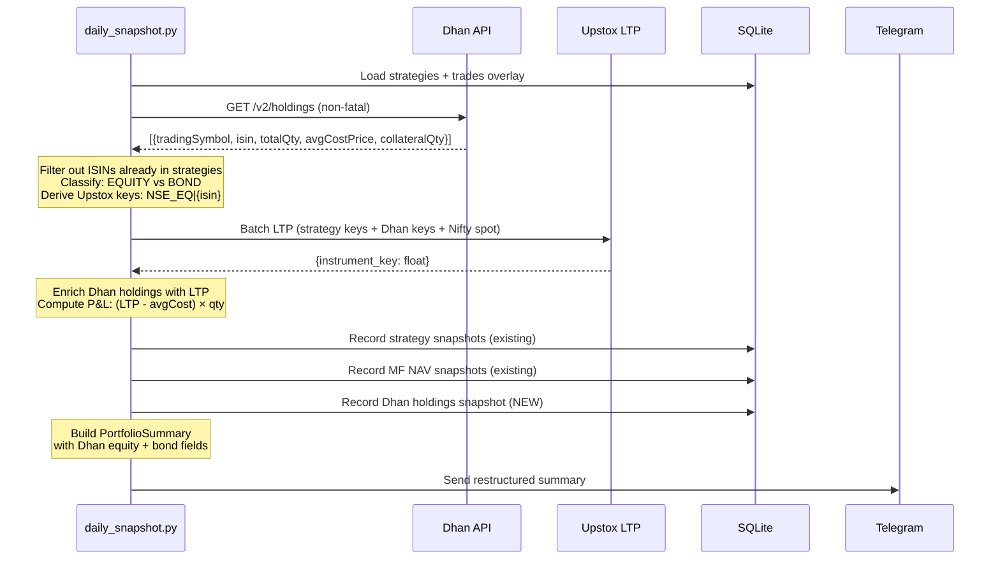

# Dhan Portfolio Integration — Equity & Bonds Breakdown

## Goal

Fetch the Dhan broker portfolio (NIFTYIETF + LIQUIDCASE) live from the API, classify holdings as **Equity** or **Bonds**, and display them as independent sections in the daily Telegram summary. Keep a placeholder for future Nuvama bond integration.

## Background

The user holds two instruments in Dhan:

| Instrument | Dhan Symbol | ISIN | Upstox Key | Classification |
|---|---|---|---|---|
| ICICI Pru Nifty 50 ETF | NIFTYIETF | INF109K012R6 | `NSE_EQ\|INF109K012R6` | **Equity** |
| Zerodha Nifty 1D Rate Liquid ETF | LIQUIDCASE | INF0R8F01034 | `NSE_EQ\|INF0R8F01034` | **Bond** |

These holdings are pledged as collateral and may be bought/sold/rebalanced — so positions must be fetched live from the Dhan API, not hardcoded. The Dhan holdings API (`GET /v2/holdings`) returns qty and avgCostPrice but **no LTP** — current prices come from the existing Upstox market data infrastructure.

### Key Insight: ISIN ↔ Upstox Key Mapping

For NSE equities, Upstox instrument key = `NSE_EQ|{ISIN}`. So we can derive the Upstox key directly from the Dhan `isin` field — no lookup file or config needed.

### Avoiding Double-Counting

The existing strategies (finideas_ilts) already track EBBETF0431 and LIQUIDBEES via the trades ledger. Dhan `GET /v2/holdings` returns ALL demat holdings, including these. We filter out ISINs already tracked by strategies to prevent double-counting.

---

## User Review Required

> [!IMPORTANT]
> **Telegram Summary Restructure** — The current flat "Combined Portfolio" format is replaced with categorized sections: Equity → Bonds → Derivatives → Total. Please review the proposed format at the bottom of this plan.

> [!IMPORTANT]
> **Dhan Token Expiry (24h)** — The Dhan API token expires daily. If the token is expired at cron time (15:45), the Dhan section simply shows `[unavailable]` and the rest of the summary proceeds. This is the same non-fatal pattern used for MF snapshots.

> [!WARNING]
> **Classification is config-driven, not automatic.** The Dhan holdings API doesn't distinguish equity ETFs from bond/liquid ETFs — both show as exchange-traded securities. A small Python dict maps known bond symbols (LIQUIDCASE, LIQUIDBEES, etc.) → `BOND`; everything else defaults to `EQUITY`. New bond instruments require a one-line config update.

---

## Proposed Changes

### Component 1: Dhan Portfolio Module (`src/dhan/`)

New module — self-contained reader + models + store for Dhan portfolio tracking.

---

#### [NEW] [\_\_init\_\_.py](file:///Users/abhadra/myWork/myCode/python/NiftyShield/src/dhan/__init__.py)

Package marker.

---

#### [NEW] [models.py](file:///Users/abhadra/myWork/myCode/python/NiftyShield/src/dhan/models.py)

Pydantic/dataclass models for Dhan portfolio:

```python
@dataclass(frozen=True)
class DhanHolding:
    """A single Dhan delivery holding with classification and current price."""
    trading_symbol: str
    isin: str
    security_id: str
    total_qty: int
    collateral_qty: int
    avg_cost_price: Decimal   # from Dhan API
    classification: str       # "EQUITY" or "BOND"
    upstox_key: str           # derived: NSE_EQ|{isin}
    ltp: Decimal | None       # populated after Upstox LTP fetch

    @property
    def cost_basis(self) -> Decimal: ...
    @property
    def current_value(self) -> Decimal | None: ...
    @property
    def pnl(self) -> Decimal | None: ...
    @property
    def pnl_pct(self) -> Decimal | None: ...

@dataclass(frozen=True)
class DhanPortfolioSummary:
    """Aggregated Dhan portfolio by classification."""
    snapshot_date: date
    equity_holdings: list[DhanHolding]
    bond_holdings: list[DhanHolding]
    equity_value: Decimal
    equity_basis: Decimal
    equity_pnl: Decimal
    bond_value: Decimal
    bond_basis: Decimal
    bond_pnl: Decimal
    # Day deltas (None on first run)
    equity_day_delta: Decimal | None
    bond_day_delta: Decimal | None
```

---

#### [NEW] [reader.py](file:///Users/abhadra/myWork/myCode/python/NiftyShield/src/dhan/reader.py)

Core logic — fetch, classify, enrich holdings:

```python
# Bond classification config (metadata, not position data)
_BOND_SYMBOLS: set[str] = {"LIQUIDCASE", "LIQUIDBEES", "LIQUIDIETF", "CASHIETF"}

def fetch_dhan_holdings(client_id: str, access_token: str) -> list[dict]:
    """Fetch raw holdings from Dhan API. Reuses auth/dhan_verify.fetch_holdings()."""

def classify_holding(raw: dict) -> str:
    """Return 'BOND' if tradingSymbol ∈ _BOND_SYMBOLS, else 'EQUITY'."""

def build_upstox_key(isin: str) -> str:
    """Derive Upstox instrument key: NSE_EQ|{isin}."""

def build_dhan_holdings(
    raw_holdings: list[dict],
    exclude_isins: set[str],   # ISINs already tracked by strategies
) -> list[DhanHolding]:
    """Parse, classify, filter, and build typed holdings (LTP=None initially)."""

def enrich_with_ltp(
    holdings: list[DhanHolding],
    prices: dict[str, float],   # from Upstox batch LTP
) -> list[DhanHolding]:
    """Return new holdings with LTP populated from the prices dict."""

def build_dhan_summary(
    holdings: list[DhanHolding],
    snapshot_date: date,
    prev_snapshot: dict[str, DhanHolding] | None,
) -> DhanPortfolioSummary:
    """Split into equity/bond, compute subtotals and day deltas. Pure function."""
```

All functions are **pure** (no I/O except `fetch_dhan_holdings`). Tests can call each independently.

---

#### [NEW] [store.py](file:///Users/abhadra/myWork/myCode/python/NiftyShield/src/dhan/store.py)

SQLite persistence for day-change tracking:

```sql
CREATE TABLE IF NOT EXISTS dhan_holdings_snapshots (
    id INTEGER PRIMARY KEY AUTOINCREMENT,
    snapshot_date TEXT NOT NULL,
    trading_symbol TEXT NOT NULL,
    isin TEXT NOT NULL,
    classification TEXT NOT NULL,  -- 'EQUITY' or 'BOND'
    total_qty INTEGER NOT NULL,
    collateral_qty INTEGER NOT NULL DEFAULT 0,
    avg_cost_price TEXT NOT NULL,  -- Decimal as TEXT
    ltp TEXT,                      -- Decimal as TEXT, NULL if LTP unavailable
    UNIQUE(isin, snapshot_date)
);
```

Same DB file (`data/portfolio/portfolio.sqlite`). Uses `src/db.py` connection factory.

```python
class DhanStore:
    def record_snapshot(self, holdings: list[DhanHolding], snapshot_date: date) -> int: ...
    def get_snapshot_for_date(self, d: date) -> list[DhanHolding]: ...
    def get_prev_snapshot(self, d: date) -> dict[str, DhanHolding]: ...  # keyed by ISIN
```

---

#### [NEW] [CLAUDE.md](file:///Users/abhadra/myWork/myCode/python/NiftyShield/src/dhan/CLAUDE.md)

Module context for AI assistants — classification config, data flow, Dhan API quirks.

---

### Component 2: PortfolioSummary Extension

---

#### [MODIFY] [models.py](file:///Users/abhadra/myWork/myCode/python/NiftyShield/src/portfolio/models.py)

Add optional Dhan portfolio fields to `PortfolioSummary` (all default to zero → existing tests unaffected):

```python
@dataclass(frozen=True)
class PortfolioSummary:
    # ... existing fields unchanged ...

    # Dhan equity component (defaults to 0 when Dhan unavailable)
    dhan_equity_value: Decimal = Decimal("0")
    dhan_equity_basis: Decimal = Decimal("0")
    dhan_equity_pnl: Decimal = Decimal("0")
    dhan_equity_day_delta: Decimal | None = None

    # Dhan bond component
    dhan_bond_value: Decimal = Decimal("0")
    dhan_bond_basis: Decimal = Decimal("0")
    dhan_bond_pnl: Decimal = Decimal("0")
    dhan_bond_day_delta: Decimal | None = None

    # Whether Dhan data was available this run
    dhan_available: bool = False
```

---

### Component 3: Daily Snapshot Integration

---

#### [MODIFY] [daily_snapshot.py](file:///Users/abhadra/myWork/myCode/python/NiftyShield/scripts/daily_snapshot.py)

**`_async_main()` changes:**

1. **After** strategy overlay, **before** LTP fetch:
   - Try loading Dhan credentials (non-fatal — `try/except ValueError`)
   - Fetch Dhan holdings via `fetch_dhan_holdings()`
   - Build `DhanHolding` list, filtering out ISINs from strategy legs
   - Add Dhan Upstox keys to the batch LTP fetch set

2. **After** LTP fetch:
   - Enrich Dhan holdings with LTP from the same prices dict
   - Record Dhan snapshot via `DhanStore`
   - Build `DhanPortfolioSummary`

3. **Summary formatting:**
   - Pass `DhanPortfolioSummary` to `_build_portfolio_summary()` and `_format_combined_summary()`
   - Dhan components included in total calculations

**`_build_portfolio_summary()` changes:**
- Accept optional `dhan_summary: DhanPortfolioSummary | None` parameter
- Populate the new Dhan fields in `PortfolioSummary`
- Include Dhan values in `total_value`, `total_invested`, `total_pnl`, `total_day_delta`

**`_format_combined_summary()` changes:**
- Restructured into sections: Equity → Bonds → Derivatives → Total → Protection
- See proposed format below

**`_historical_main()` changes:**
- Load stored Dhan snapshots for the queried date
- Reconstruct `DhanPortfolioSummary` from stored data
- Pass to the restructured formatter

---

### Component 4: Instrument Lookup Enhancement

---

#### [MODIFY] [lookup.py](file:///Users/abhadra/myWork/myCode/python/NiftyShield/src/instruments/lookup.py)

Add `search_by_isin()` method (useful for future integrations, not strictly needed for this task since we derive keys from ISIN directly):

```python
def search_by_isin(self, isin: str) -> dict[str, Any] | None:
    """Look up an instrument by its ISIN code."""
    for inst in self._instruments:
        if inst.get("isin") == isin:
            return inst
    return None
```

---

### Component 5: Tests

---

#### [NEW] tests/unit/dhan/

| Test File | Coverage |
|---|---|
| `test_models.py` | DhanHolding properties (cost_basis, current_value, pnl, pnl_pct), edge cases (None LTP, zero qty) |
| `test_reader.py` | classify_holding, build_upstox_key, build_dhan_holdings (filtering, classification), enrich_with_ltp, build_dhan_summary (pure P&L math, day deltas) |
| `test_store.py` | record_snapshot, get_snapshot_for_date, get_prev_snapshot, upsert idempotency, schema coexistence |
| `test_daily_snapshot_dhan.py` | Integration: Dhan section in formatted summary, double-count filtering, Dhan unavailable fallback |

All tests fully offline — Dhan API responses mocked via fixtures.

#### [NEW] tests/fixtures/responses/dhan_holdings.json

Sample Dhan holdings response with NIFTYIETF, LIQUIDCASE, and EBBETF0431 (to test filtering).

---

### Component 6: Documentation Updates

---

#### [MODIFY] CONTEXT.md, DECISIONS.md, REFERENCES.md, TODOS.md

- **CONTEXT.md**: Add `src/dhan/` to the file tree, update test counts
- **DECISIONS.md**: Add "Dhan Portfolio Integration" section — classification config, ISIN→key derivation, double-count filtering, non-fatal design
- **REFERENCES.md**: Add NIFTYIETF and LIQUIDCASE to instrument keys table, add Dhan holding API response format
- **TODOS.md**: Add future items — Dhan intraday F&O P&L, Nuvama bond integration

---

## Data Flow



---

## Proposed Telegram Summary Format

```
🟢 NiftyShield snapshot 2026-04-14
  Hedge: ⚠️  Exposed  (-43,799)

  ── Equity ─────────────────────────────────────────────
  MF (11 schemes)     : ₹  7,962,496  Δday:    -43,799
                        P&L: +1,796,930 (+29.14%)
  Finideas ETF        : ₹    672,954  Δday:         +0
                        (basis ₹667,424)
  Dhan NIFTYIETF      : ₹    XXX,XXX  Δday:     +X,XXX
                        P&L: +XX,XXX (+X.XX%)
  ───────────────────────────────────────────────────────
  Equity subtotal     : ₹  X,XXX,XXX

  ── Bonds ──────────────────────────────────────────────
  Dhan LIQUIDCASE     : ₹    XXX,XXX  Δday:       +XXX
                        P&L: +XX,XXX (+X.XX%)
  ───────────────────────────────────────────────────────
  Bonds subtotal      : ₹    XXX,XXX

  ── Derivatives ────────────────────────────────────────
  Options net P&L     :      +10,951  Δday:         +0

  ═══════════════════════════════════════════════════════
  Total value         : ₹  X,XXX,XXX  Δday:    -XX,XXX
  Total invested      : ₹  X,XXX,XXX
  Total P&L           :  +X,XXX,XXX  (+XX.XX%)

  ── FinRakshak Protection ──────────────────────────────
  MF Δday             :         -43,799
  FinRakshak Δday     :              +0
  ───────────────────────────────────────────────────────
  Net (MF + hedge)    :         -43,799  ⚠️  Exposed
```

> [!NOTE]
> When Dhan is unavailable (token expired), the Dhan lines show `[unavailable]` and are excluded from totals — same pattern as MF failure handling.

---

## Future TODOs (Not in This Implementation)

1. **Dhan Intraday F&O P&L** — Fetch `GET /v2/positions` for `realizedProfit + unrealizedProfit`. Add a "Dhan F&O" line to Derivatives section. Requires active intraday positions.

2. **Nuvama Bond Portfolio** — Fetch via `APIConnect.Holdings()`. Parse NCDs, GOI bonds, SGBs. Add to Bonds section. Auth already done (`src/auth/nuvama_verify.py` confirmed 6 holdings: 5 EFSL NCDs + 1 GOI loan bond + 1 SGB).

3. **Dhan Data APIs (₹499/month)** — Would enable direct LTP from Dhan (eliminating Upstox dependency for Dhan holdings) and historical data for backtesting.

---

## Open Questions

> [!IMPORTANT]
> **Summary format**: Does the proposed Telegram format above look right? The multi-line format (value on one line, P&L on the next) keeps lines shorter but uses more vertical space. Alternative: single-line per item with abbreviations. Your call!

> [!NOTE]
> **EBBETF0431 classification**: Bharat Bond ETF is technically a bond ETF but it's tracked under the Finideas ILTS strategy. It stays in the "Finideas ETF" line (under Equity). If you'd prefer it reclassified under Bonds, that's a separate refactor.

---

## Verification Plan

### Automated Tests
```bash
python -m pytest tests/unit/dhan/ -v     # New Dhan tests
python -m pytest tests/unit/ -v          # Full suite — no regressions
```

### Manual Verification
1. Run `python -m src.auth.dhan_verify` to confirm Dhan token is valid and see current holdings
2. Run `python -m scripts.daily_snapshot` in live mode — verify:
   - Dhan holdings appear in summary (NIFTYIETF under Equity, LIQUIDCASE under Bonds)
   - No double-counting of EBBETF0431/LIQUIDBEES
   - Totals include Dhan values
   - Telegram notification received with new format
3. Run `python -m scripts.daily_snapshot --date <today>` — verify historical query shows stored Dhan data
4. Test with expired Dhan token — verify graceful fallback (Dhan section shows `[unavailable]`)
