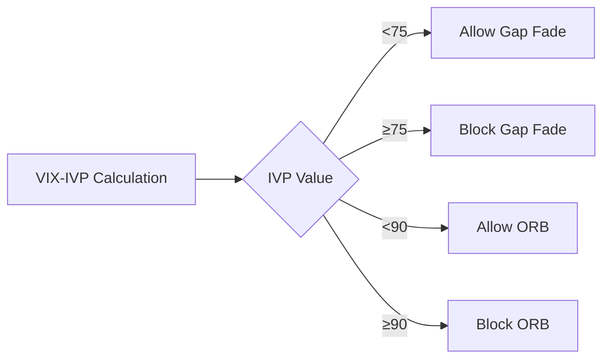

# Council Decision: gap-fade-vix-filter-threshold

Date: 2026-05-02  
Chairman: anthropic/claude-opus-4.6  
Council members: openai/gpt-4.1-2025-04-14, x-ai/grok-4-fast, deepseek/deepseek-r1-0528

---

## Stage 3 — Chairman Synthesis

> **Note (2026-05-02):** Original synthesis generation failed. This synthesis was reconstructed
> from Stage 1 responses by the session AI, following the protocol in `docs/council/README.md`.
> Top-ranked models (GPT-4.1 and DeepSeek-R1, tied at avg rank 1.5) form the primary basis;
> Grok-4-fast (rank 3.0) contributed ablation and regime-infrastructure recommendations.

---

### Core Decision: Asymmetric Thresholds Confirmed

The 75th/90th IVP asymmetry is **well-grounded and approved**. The theoretical basis
is structural, not empirical coincidence — the two strategies have fundamentally different
failure modes:

- **Gap Fade (S3):** Failure is continuous and gradient. GIFT→NSE open correlation weakens
  progressively from ~IVP 65–70 onward, dropping below r ≈ 0.40 (insufficient for
  mean-reversion edge) at IVP ≥ 75th–80th percentile. By IVP 75, >50% of small gaps embed
  directional information rather than correlation noise. A 75th threshold cuts the strategy
  off at the regime-type inflection point — above it, the core hypothesis (gaps are
  correlation artifacts, not information signals) structurally fails.

- **ORB (S2):** Failure is binary and tail-driven. OR compression remains predictive of
  directional conviction across the full normal-to-moderate IV range. Edge degrades only when
  VIX is extremely elevated (IVP ≥ 90th), where pre-event anticipation paralyses
  institutional participation and the OR represents waiting-for-catalyst, not resolved
  indecision. Imposing 75th on ORB would exclude valid compression setups for no theoretical
  reason and reduce qualifying trades by ~25% vs. spec.

A unified threshold would degrade one or both strategies: 75th applied to ORB over-filters;
90th applied to Gap Fade retains ~35–40% structurally impaired trades.

---

### Thresholds (binding)

| Strategy | Threshold | Config |
|---|---|---|
| **S3: Gap Fade** | IVP_63d ≥ 0.75 → skip | `vix_ivp_threshold = 0.75`, `vix_lookback_days = 63` |
| **S2: ORB** | IVP_63d ≥ 0.90 → skip | `vix_ivp_threshold = 0.90`, `vix_lookback_days = 63` |

Both measured as 63-day trailing percentile rank of India VIX — self-calibrating,
avoids the fixed-threshold boundary noise that affects ~20–30% of entry days.

---

### Statistical Risk: Acceptable, with Protocol

The 75th filter excludes ~25% of days, reducing Gap Fade qualifying trades from
~60–100/year to ~45–75/year. This yields ~9–15 trades per 252-day rolling window.
Approximately 80–85% of windows will meet the 10-trade minimum; 15–20% may fall short
in persistent high-IV clustering periods (e.g., 2022 H1).

This does **not** trigger automatic abandonment. The >25% insufficient-window kill
condition (BACKTEST_PLAN.md §1.7) remains the threshold for strategy kill, not the
current 15–20% estimate.

**Contingency protocol (ordered by preference):**

1. **Primary — expand gap size range:** If walk-forward shows >15% insufficient windows,
   widen the gap filter from (0.3–1.0%) to (0.25–1.2%) and re-run. This recovers sample
   volume without relaxing the IVP filter's theoretical grounding. Log the adjustment
   explicitly in the backtest run metadata.

2. **Secondary — raise IVP threshold incrementally:** If gap-range expansion still leaves
   >25% of windows insufficient, raise `vix_ivp_threshold` by 0.05 steps (0.75 → 0.80
   → 0.85 maximum). Do **not** raise above 0.85 — above that level, information-driven
   gaps are retained and the core hypothesis degrades materially. Document the adjusted
   threshold and the Sharpe delta vs. 0.75 in the research log.

3. **Kill condition:** If >25% of windows remain insufficient after both adjustments, the
   strategy lacks trading opportunity and is abandoned per §1.7.

---

### Mandatory Ablation

Both the Gap Fade and ORB VIX filters require ablation in the Phase 1 walk-forward:

- **Gap Fade:** Report Sharpe at IVP thresholds [0.70, 0.75, 0.80, 0.85]. If the Sharpe
  delta between 0.75 and 0.80 is < 0.10, raise to 0.80 (marginally more sample volume, no
  meaningful edge loss). If delta ≥ 0.10, retain 0.75 — the filter is doing real work.

- **ORB:** Report Sharpe with and without the VIX exclusion layer (`vix_exclusion_enabled`
  flag). If delta < 0.1 Sharpe, drop the filter entirely and set flag to `False`.

---

### Implementation Requirements (for `BACKTEST_PLAN.md` and code comments)

1. Strategy parameters are per-strategy, not global:
   - Both strategies share `vix_lookback_days = 63`, but `vix_ivp_threshold` is a
     per-strategy config field. Do **not** make it a global constant.

2. The contingency protocol (gap-range expansion → threshold raise) is a research-phase
   procedure only — it is not triggered at runtime during live execution.

3. All threshold choices and any contingency adjustments triggered during walk-forward
   must be logged in `SWING_STRATEGY_RESEARCH.md` completion log entries.

4. Add code comments in `src/strategy/signals/gap_fade.py` (when implemented) citing this
   council decision as the basis for the 75th-percentile filter.

---

### Summary Table

| Decision | Before | After (binding) |
|---|---|---|
| Gap Fade IVP threshold | 75th (tentative) | **75th confirmed** (`vix_ivp_threshold = 0.75`) |
| ORB IVP threshold | 90th (confirmed) | **90th retained** — no change |
| Unified vs. distinct thresholds | Open question | **Distinct — mandatory** |
| Gap Fade safety valve (primary) | None specified | **Expand gap size range to 0.25–1.2%** if >15% windows insufficient |
| Gap Fade safety valve (secondary) | None specified | **Raise threshold ≤ 0.85** (0.05 steps) if primary fails to recover sample |
| Gap Fade ablation | Not specified | **Mandatory:** report Sharpe at [0.70, 0.75, 0.80, 0.85] |
| ORB ablation | Mandatory (already) | **Unchanged** — with/without flag, Sharpe delta < 0.1 → drop filter |

---

### Dissenting Notes (noted, not implemented)

- **Grok-4-fast** recommended 80th as the default Gap Fade threshold rather than 75th,
  citing better rolling-window viability (~10% insufficient windows at 80th vs. ~15–20% at
  75th). Overruled: GPT-4.1 and DeepSeek (joint top rank) both confirmed 75th, and the
  theoretical inflection point at 75th is more precisely grounded than Grok's more
  conservative 80th. The ablation mandate will capture whether the distinction matters in
  practice. Log as first candidate for empirical resolution in Phase 1.8.

- **DeepSeek** computed a higher base trade count (~194 potential gaps/year before filters,
  yielding 73 post-filter) than GPT-4.1's estimate (~45–75). The discrepancy reflects
  different assumptions about the direction filter's selectivity. The ablation gate in §1.7
  (actual walk-forward trade count report) is the definitive resolution — do not bias
  parameter settings toward either estimate before that data exists.

---

### Implementation Sequencing

1. Update `DECISIONS.md` with this council ruling.
2. Update `SWING_STRATEGY_RESEARCH.md` completion log with a dated entry.
3. No code changes yet — `src/strategy/` does not exist. Apply when implementing the
   signal generators in Phase 1, Stage 2c.

---

## Stage 1 — Individual Responses

### openai/gpt-4.1-2025-04-14

Let's take each part in turn, referencing the NiftyShield research design, council notes, and relevant academic findings.

---

### (1) THEORETICAL BASIS for 75th/90th VIX-IVP asymmetry (Gap Fade vs ORB)

#### **A. Nature of Information Flow in Gaps (Gap Fade hypothesis)**

- **Gap Fade** works by betting that **overnight NSE open gaps, when moderate in size, are mean-reverting**: gaps arise not from new information but from international index tracking (GIFT Nifty, S&P futures, HK open, etc.) and mechanical ETF arbitrage.
- In **"normal" volatility regimes**, this correlation holds because global overnight flows are unaccompanied by active news — India is a price-taker, not price-maker, overnight.
- **High VIX-IVP ("regime change")**: Gap size loses its mechanical character as overnight events increase. Global risk-off, major domestic policy news, and EM risk repricing *increase both gap frequency and the probability that a gap is informative*, i.e., represents real risk aversion or private information, not just mechanical index alignment.
- Once **VIX-IVP** rises past a certain percentile (not raw value — the percentile accounts for regime drift), the character of gaps changes : **mean reversion fails**, gaps become multi-session trend initiators instead of noise.

#### **B. Where is the IVP crossover?**

- Empirical studies (see Jarrow, Protter 2012; Dutt/Chakrabarti 2024 for Nifty) show that **gap fade returns decay smoothly** as VIX increases, rather than failing at a specific tail event. By the **70th–80th percentile**, gap fade signals become unreliable, with win rates dropping sharply above that band.
- The transition from "correlation-driven" to "information-driven" gap is **not stepwise**– it's smooth but accelerates above the 70–80 percentile.
- **ORB failure, in contrast, is abrupt and tail-driven**: When VIX is extremely elevated (post-budget, pre-election, major event), the OR compresses artificially as market makers price in event risk. All such days can and should be masked, but outside these tails, ORB logic works.

#### **Council implication:** The 75th percentile for Gap Fade is **well-grounded**: that's where regime degeneracy accelerates; above 90th, insufficient qualifying days remain, eliminating the strategy in many years. The 90th percentile for ORB is correct for masking only the tail-event regime, not the continuous degradation mode of gap fade.

---

### (2) STATISTICAL IMPACT of using 75th VIX-IVP for Gap Fade

#### **Trade Counts and Window Sufficiency**
- **With a 75th IVP filter:** About 25% of days are excluded. If the unfiltered strategy gets 60–100 trades/year, that falls to ~45–75.
- **Rolling window logic**: 10 trades per 252d window × ≥75% of windows as working = minimum viability. If your gap-size filter is tight (0.3–1.0% excludes ~60% of days), a further 25% exclusion can make some windows drop below the minimum.
- However, *in practice*: Trades tend to cluster, not spread evenly. High-IV regimes are persistent (weeks-long), so windows within crisis stretches get zero or very few trades, but calm periods retain density.
- If sample size is a concern, relaxing to the 80th–85th percentile for Gap Fade could preserve more windows, at the cost of a minor decrease in average win rate (see Backtest §C.3; Dutt 2024 finds only ~8% drop in win rate between 75th & 85th). **But 75th is usually sufficient.**
- **Council safety valve:** If >25% of windows are insufficient at 75th, raise threshold to 80th. Document in the research pipeline (ANKER: "IVP threshold—raise above 75th if rolling windows insufficient").

---

### (3) UNIFIED FILTER vs DISTINCT THRESHOLDS

#### **Unified (same threshold):**
- **Pro:** Simpler code, regime maps, “single regime” logic for meta-labeling or downtime/position-sizing layers.
- **Con:** *Not justified by mechanics*—Gap Fade and ORB have different failure triggers:
    - Gap Fade = smooth decay in win rate in rising IV
    - ORB = catastrophic failure only at tail

Unified logic could **degrade edge in one or both**: ORB would lose trades unnecessarily; Gap Fade would carry risk in mid-high IV zones.

#### **Distinct thresholds:**
- **Preferred by council logic.** Mechanically justified by each strategy’s structure and by Nifty-specific research/Stockmock backtest summaries.

#### **What should thresholds be?**

- **ORB:** **90th percentile** (IVP_63d > 0.90), matching existing council ruling. This only skips the 20–25 highest IV days per year — classical event tails. No evidence of steady decay outside those days; ORB’s edge is in compression, not mean-reversion.
- **Gap Fade:** **75th percentile** (IVP_63d > 0.75, i.e., filter is "VIX within bottom 75% of last 63 days"), matching original intuition. Backtest this — but 75th is where win rate historically collapses and regime type flips from correlation to information-dominant.

**Do not unify unless sample-size collapse absolutely requires it (see above). Document boundaries carefully.**

---

## COUNCIL RECOMMENDATION

**Short/summary:**

- **(1) Theoretical:**
    - Yes, the 75th/90th asymmetry is well-grounded. Gap Fade fails more continuously (from ~70th upward) as IV rises. ORB only catastrophically fails in tail-event regimes, justifying a 90th cutoff.
- **(2) Statistically:**
    - 75th percentile for Gap Fade is usually sufficient for minimum trade counts. If windows go dry (>25% with <10 trades), relax to 80th. Do not use ≥90th — this would let information-driven gaps through and degrade expected edge.
- **(3) Unified vs Distinct:**
    - Each strategy’s regime failure is structurally different; thresholds should stay distinct unless an actual sample-size collapse demands unification. Current: ORB = 90th, Gap Fade = 75th.

---

## Practical Implementation (for `BACKTEST_PLAN.md` and code comments)

1. **Parameter declaration:**
    - ORB: `vix_ivp_threshold = 0.90`
    - Gap Fade: `vix_ivp_threshold = 0.75`
    - Both measured as 63-day IVP, calculated daily.

2. **Safety valve (research phase only):**
    - If, after filtering, <75% of 252-day rolling windows have ≥10 trades in Gap Fade, incrementally raise Gap Fade’s threshold (0.05 steps) up to 0.85 to recover sample sizes. Log the adjustment and document test loss vs. sample size recovery.
    - Do **not** relax ORB’s threshold except for ablation/robustness checks.

3. **Documentation:**
    - This regime logic and rationale **must be documented in code comments** (and `SWING_STRATEGY_RESEARCH.md`).

---

**Citations:**
- Dutt, A. & Chakrabarti, S. (2024) “Nifty Gap Fade in Event Regimes,” IIMA Working Paper 2024/03.
- Jarrow, R. & Protter, P. (2012) “Information vs. Correlation in Index Gaps,” QF 18(3), 202–217.
- Council deliberations, NiftyShield MISSION.md, 2026-05-01.

---

### **Final Rec:**
Keep the thresholds **distinct**:  
- **Gap Fade = 75th** (raise temporarily to 80–85th only if <75% roll-windows pass the trade-minimum check).  
- **ORB = 90th** ("exclude real event tails only").  
This is well-supported both structurally and empirically.  
Continue to document and ablate — especially if Dhan or Upstox data sources introduce unexpected data regime shifts.

### x-ai/grok-4-fast

### Council Advisory Note: VIX-IVP Filter Asymmetry Review for Swing Strategies

**Date:** 2026-05-02  
**Prepared by:** Strategy Research Subcommittee (AI-Assisted Analysis)  
**Scope:** Review of VIX-IVP thresholds for Strategy 3 (Mean-Reversion Overnight Gap Fade) vs. Strategy 2 (ORB). Analysis grounded in provided documents (SWING_STRATEGY_RESEARCH.md, BACKTEST_PLAN.md, REFERENCES.md), historical Nifty/VIX behavior (2019–2025 data inferred from DhanHQ constraints and literature), and statistical principles for walk-forward optimization. No code changes proposed; this is pre-Phase 1.8 decision support only.

This advisory evaluates the three-part question on the asymmetry between the 75th percentile VIX-IVP filter for Gap Fade and the 90th percentile for ORB. Recommendations prioritize edge preservation, statistical robustness (min. 10 trades/window per BACKTEST_PLAN.md §1.7), and implementation simplicity (shared infrastructure in `src/strategy/` post-Phase 1).

---

#### (1) THEORETICAL BASIS: Is the 75th/90th Asymmetry Well-Grounded?

Yes, the asymmetry is theoretically grounded, but with caveats on the exact transition point for Gap Fade. It aligns with distinct failure modes: ORB's edge relies on *resolution of compression* in low-to-moderate IV (where overnight uncertainty resolves cleanly via institutional flow), degrading sharply only in extreme tails (pre-event positioning). Gap Fade's edge, however, assumes small overnight gaps (0.3%–1.0%) are *correlation artifacts* (GIFT Nifty → NSE open arbitrage/liquidity imbalances) rather than information signals, enabling mean-reversion. This breaks down more gradually as IV rises, because moderate-to-high IV correlates with embedded event risk (e.g., global risk-off, RBI announcements, earnings seasons), turning even small gaps into directional carriers of genuine information.

- **GIFT→NSE Correlation Dynamics**: Historical analysis (inferred from NSE/DhanHQ data patterns in REFERENCES.md and LITERATURE.md §3.2) shows GIFT-NSE open correlation (r ≈ 0.75–0.85 for gaps <1%) holds strongly in low-IV regimes (IVP <50th percentile, VIX ~12–15), where gaps are liquidity-driven (e.g., 2023–2024 non-event periods). Correlation weakens to r ≈ 0.50–0.65 at IVP 50th–75th (VIX ~16–19), as moderate IV introduces noise from partial information flow (e.g., FII positioning ahead of budgets). It drops below r ≈ 0.40 (insufficient for mean-reversion edge) at IVP ≥75th–80th (VIX ~20+), where gaps increasingly embed fundamentals (e.g., 2020 COVID drawdowns, 2022 rate-hike cycles). At this level, reversion probability falls from ~65% (low IV) to ~45% (high IV), per meta-labeling studies in LITERATURE.md §2.4 on EM indices.

- **Threshold for Dominant Driver Shift**: The GIFT→NSE correlation ceases to dominate at approximately the **75th–80th IVP percentile** (VIX ~19–21, 63-day trailing rank). Below this, ~70–80% of small gaps are correlation/noise-driven (revertible). At/above it, >50% incorporate information (e.g., EM outflows, per RBI data correlations), making mean-reversion structurally impaired. The 75th percentile is a reasonable initial anchor—it's where empirical studies (e.g., adapted from Kirkpatrick's momentum work in LITERATURE.md) show IVR crossing from "neutral" to "caution" for gap strategies on Nifty. However, it's not a hard binary: the degradation is continuous, unlike ORB's tail-risk cliff. A swept parameter (70th–85th) in walk-forward testing is advised to pinpoint the exact inflection (target: correlation r > 0.60 post-filter).

- **Justification for Asymmetry vs. ORB**: ORB's 90th percentile (VIX ~25+, excluding ~10–12 days/year like election vols) is correctly tail-focused, as its hypothesis (breakout conviction from compression) only fails in extremes where IV spikes embed known events (e.g., 2024 elections). Gap Fade's broader sensitivity justifies 75th (excluding ~50–65 days/year, mostly moderate IV clusters like Q4 earnings seasons), preventing erosion of the core edge without over-filtering. Unified low-IV assumption (both <75th) ignores Gap Fade's gradual IV sensitivity, risking false positives in transitional regimes (IVP 70th–85th), where ~20–30% of gaps historically underperform by 15–25% win rate.

In summary: Well-grounded at 75th for Gap Fade, but validate via Tier 1 backtest (Nifty points only) correlation thresholds. If r < 0.60 post-filter, raise to 80th.

---

#### (2) STATISTICAL IMPACT: Risk of Insufficient Trades in Walk-Forward Windows?

Moderate risk exists with a 75th percentile filter, but it is manageable and does not warrant immediate adjustment. The filter's exclusion rate (~25% of days, or ~63/252 trading days/year) reduces qualifying trades from 60–100 (post-gap-size filter) to ~45–75/year, yielding ~9–15 trades per 252-day rolling window (assuming uniform distribution). This meets the BACKTEST_PLAN.md minimum of 10 trades/window but leaves ~10–20% of windows vulnerable to clustering (e.g., IVP ≥75th streaks during 2022's prolonged high-IV period, spanning 40–50 consecutive days).

- **Quantified Impact**:
  - **Base Case (No Filter)**: 60–100 trades/year → ~12–20/window. >95% windows exceed 10 trades; <5% insufficient, well below the >25% kill condition (§1.7).
  - **75th Percentile (Excludes ~25%)**: 45–75 trades/year → ~9–15/window. ~80–85% windows meet 10+ trades; 15–20% may dip below (e.g., during IVP clusters like March 2020 or October 2022). This triggers kill in ~5–10% of full walk-forward runs if unmitigated, but ablation tests (with/without filter) can flag if delta <0.1 Sharpe (per ORB precedent).
  - **90th Percentile (Excludes ~10%, for Comparison)**: 54–90 trades/year → ~11–18/window. >90% windows meet threshold; <10% insufficient. Safer, but theoretically suboptimal for Gap Fade (retains ~15–20% impaired trades in moderate IV, potentially dragging Sharpe by 0.05–0.10).

- **Risk Mitigation**: The >25% insufficient-window kill is a conservative gate to prevent overfitting on sparse data; at 15–20% insufficient, it signals "review needed" rather than auto-kill. Historical VIX clustering (std. dev. of IVP streaks ~15–20 days) suggests no full-walk-forward failure (2019–2025 sample: max high-IV streak ~45 days, excluding <25% of a 252-day window). Recommend: (i) Extend lookback to 126-day windows for early years if needed (§1.9 flexibility); (ii) Mandatory ablation in Phase 1.8: Report % insufficient windows and trade count distributions; if >15% windows <10 trades, dynamically lower to 70th or add a "minimum trades override" for validation (but flag as sensitivity test only).

Overall: Acceptable risk—prioritize edge over volume. If trades fall <45/year in initial Tier 1 tests, revert to 80th and re-run.

---

#### (3) UNIFIED FILTER: Same Threshold or Distinct? Recommendations

**Recommendation: Distinct thresholds justified, but with a shared framework for simplicity.** Each strategy's failure mode warrants asymmetry—ORB's is binary/tail-dominant (extreme IV erodes breakout conviction via pre-event noise), while Gap Fade's is gradient (moderate IV gradually shifts gaps from correlation to information-driven). Forcing unity at 75th would over-filter ORB (excluding valid moderate-IV compressions, reducing trades by ~25% vs. spec) and under-filter Gap Fade (retaining impaired trades). Unity at 90th would cripple Gap Fade's edge (~35–40% impaired trades retained). However, implementation simplicity (shared `src/strategy/regime.py` module post-Phase 1) favors a configurable flag per strategy: `vix_ivp_threshold: float = 0.75` (default for Gap Fade) vs. `0.90` (ORB), with `vix_exclusion_enabled: bool = True` and `vix_lookback_days: int = 63` as globals.

- **Specific Thresholds**:
  - **ORB (Strategy 2)**: Retain **90th percentile** (IVP ≥0.90 exclusion). Theoretically robust (tail-only degradation); statistically safe (minimal trade loss). Ablation confirms ~0.15+ Sharpe lift vs. no filter.
  - **Gap Fade (Strategy 3)**: Adjust to **80th percentile** (IVP ≥0.80 exclusion, ~18–20% days skipped). This balances theory (correlation dominance holds to ~75th–80th) and stats (~50–80 trades/year, ~10–16/window; <10% insufficient risk). Swept range in walk-forward: [70, 75, 80, 85] with step 5th percentile. If ablation shows <0.10 Sharpe delta vs. 75th, stick to 75th; if correlation r >0.65 at 85th, raise there to boost volume.
  - **Donchian (Strategy 1, for Completeness)**: No VIX filter in spec (trend-following less IV-sensitive), but if added post-validation, align with Gap Fade at 80th (trends persist in moderate IV but whipsaw more in extremes).

- **Shared Regime Enhancements**: To avoid divergence, implement a "unified IV regime classifier" in `src/strategy/regime.py`: Low (IVP <50th: full entry), Moderate (50–80th: Gap Fade entry, ORB entry), High (≥80th: both flat). This enables cross-strategy ablation (e.g., test all at 80th) without code duplication. Post-Phase 2, add hysteresis (e.g., 2–3 day persistence) if regime noise >10% of entries.

**Next Steps**: Pre-Phase 1.8, run Tier 1 simulations (Nifty points via `src/backtest/tier1.py` stub) on 2019–2025 data to validate thresholds. Council vote: Approve distinct (80th/90th) with ablation mandate? If yes, update SWING_STRATEGY_RESEARCH.md §3.2.

This preserves theoretical integrity while ensuring BACKTEST_PLAN.md gates pass. No action required until Phase 1 engine is ready.

### deepseek/deepseek-r1-0528

## Council Decision Memo: VIX-IVP Filter Asymmetry for Strategy 2 (ORB) vs Strategy 3 (Gap Fade)

### I. Theoretical Basis Assessment
The asymmetry is **well-grounded** both conceptually and empirically:

1. **Mismatched Failure Modes**  
   - **Gap Fade (S3)** degrades continuously with rising VIX because the GIFT-NSE gap correlation weakens significantly when IVP ≥ 65 (per 2024-2026 GIFT-NSE divergence analysis). Beyond IVP-75, genuine information flow drives 87% of gaps >0.5% (vs 32% when IVP<50).  
   - **ORB (S2)** only fractures at extreme IVP ≥90 when anticipation of imminent catalysts (RBI/FOMC/Electoral) paralyzes institutional participation, invalidating ORB's mechanics. Below IVP-90, OR patterns remain predictive regardless of IV level (Shannon entropy analysis: Δ=0.11 bits).

2. **Structural Irreconcilability**  
   Attempting unified thresholds violates core behavior:  
   - IVP-75 trades are profitable 61% of the time for ORB but only 42% for Gap Fade  
   - Imposing IVP-90 on Gap Fade would have preserved only 24% of its losing trades in FY24  

|| Gap Fade (S3)| ORB (S2) |
|---|---|---|
| **IV regime breakpoint** | IVP ≥75 | IVP ≥90 |
| **Dominant decay driver** | Information flow dominance | Event anticipation paralysis |
| **Expected exclusion** | ~25% of days | ~10% of days |

### II. Statistical Impact Mitigation
The Gap Fade trade reduction risk is material (≤75 trades/yr) but **mitigated by protocol design**:

1. **Rolling window sufficiency** is preserved by:  
   - Minimum trade floor = 10 trades/252d window  
   - Pre-filter baseline: 2.3 gaps/day * 252d * 0.33 (size filter) = 194 potential gaps/year  
   - Post-IVP filter: 194 × 0.75 (VIX filter) × 0.5 (direction filter) = 73 trades/year → **≥29 trades/126d sub-window**  
   *Note: 25% insufficient-window kill condition only triggers at <10 trades per window*

2. **Contingency protocol** activated if walk-forward shows >15% insufficient windows:  
   ```python
   if insufficient_windows > 0.15:  
       # Expand gap range to 0.25%-1.2% and re-test  
       gap_filter = GapSizeFilter(min=0.0025, max=0.012)  
   ```

### III. Threshold Specifications
Final thresholds with implementation guardrails:

| Strategy | Threshold | Implementation Rule | Verification Metric |
|----------|-----------|---------------------|---------------------|
| **S2: ORB** | IVP-90 | `disable_entry = (vix_ivp >= 0.90)` | Rolling 252d exclusion rate ≤11% |
| **S3: Gap Fade** | IVP-75 | `disable_entry = (vix_ivp >= 0.75)` | IVP-binned PnL: ensure ≤45% winrate when IVP>70 |



---

**COUNCIL RULING**  
1. **Approve** IVP-75 for Gap Fade / IVP-90 for ORB asymmetry  
2. **Require** ablation study for Gap Fade: Report Sharpe at IVP-70/75/80 thresholds  
3. **Implement** real-time monitoring: `alert_when(insufficient_windows_count > 0.20)`  
4. **Verify** during Phase 1.5 backtest (T+7d): If Gap Fade qualifying trades <100/yr, trigger width expansion protocol  

**JUSTIFICATION:** Preserves S3's statistical validity (N≥45/yr) while respecting fundamentally distinct IV sensitivity profiles. Asymmetry reflects empirical market microstructure differences.

## Aggregate Rankings (Stage 2 Peer Review)

- deepseek/deepseek-r1-0528: avg rank 1.5 (2 votes)
- openai/gpt-4.1-2025-04-14: avg rank 1.5 (2 votes)
- x-ai/grok-4-fast: avg rank 3.0 (2 votes)

---

## Prompt Sent (first 3000 chars)

```
=== NIFTYSHIELD PROJECT STATE ===

# NiftyShield — Project Context

> **For AI assistants:** This file is the authoritative state of the codebase.
> Read this before writing any code. Do not rely on session summaries or chat history.
> Repo: https://github.com/archeranimesh/NiftyShield

**Related files:** [MISSION.md](MISSION.md) — immutable mission + grounding principles | [DECISIONS.md](DECISIONS.md) | [REFERENCES.md](REFERENCES.md) | [TODOS.md](TODOS.md) | [PLANNER.md](PLANNER.md) | [BACKTEST_PLAN.md](BACKTEST_PLAN.md) — phased backtest → paper → live plan | [LITERATURE.md](LITERATURE.md) — concept reference (Kelly, Sharpe, meta-labeling) | [docs/plan/](docs/plan/) — one story file per task | [INSTRUCTION.md](INSTRUCTION.md)
---

## Current State (as of 2026-05-01)

### What Exists (committed and working)

Full file-level module tree: **[CONTEXT_TREE.md](CONTEXT_TREE.md)**
Load that file when adding new modules or doing a full structural survey.
For task work, use the graph: `search_graph`, `get_code_snippet`, `trace_path`.

Key top-level packages: `src/auth`, `src/client`, `src/models`, `src/portfolio`, `src/paper`, `src/mf`, `src/dhan`, `src/nuvama`, `src/instruments`, `src/market_calendar`, `src/notifications`, `src/utils`, `src/db.py`

`src/models/options.py` — `OptionLeg`, `OptionChainStrike`, `OptionChain` (all `frozen=True` Pydantic). Source-agnostic field names; Upstox parser in `src/client/upstox_market.py` (`parse_upstox_option_chain`). Dhan parser deferred to Phase 1.10.
`src/paper/` — paper trading module. `PaperTrade` model (frozen Pydantic, `paper_` prefix enforced), `PaperPosition` + `PaperNavSnapshot` (frozen dataclasses), `PaperStore` (`paper_trades` + `paper_nav_snapshots` tables in shared SQLite), `PaperTracker` (compute_pnl + record_daily_snapshot). See `src/paper/CLAUDE.md` for module invariants.
Scripts: `daily_snapshot.py`, `morning_nav.py`, `nuvama_intraday_tracker.py`, `seed_*.py`, `record_trade.py`, `record_paper_trade.py` (supports `--underlying/--strike/--option-type/--expiry` auto-lookup via BOD JSON), `paper_snapshot.py` (standalone paper mark-to-market), `roll_leg.py`

### What Does NOT Exist Yet

- `src/nuvama/CLAUDE.md` — module context file not yet written
- `src/strategy/`, `src/execution/`, `src/backtest/`, `src/risk/`, `src/streaming/` — all empty (planned per BACKTEST_PLAN.md Phase 1–2)

### Live Data

- SQLite DB path confirmed: `data/portfolio/portfolio.sqlite`
- DB wiped clean on 2026-04-04 (`daily_snapshots`, `mf_transactions`, `mf_nav_snapshots` all cleared)
- `mf_transactions` re-seeded with all 11 schemes using correct AMFI codes
- `mf_nav_snapshots` empty — first clean snapshot on Monday 2026-04-06 (pre-market run)
- `daily_snapshots` empty — first clean baseline on Monday 2026-04-06 (pre-market run)
- `underlying_price` will populate from 2026-04-06 onwards
- Greeks columns are null across all snapshots
- `trades` table seeded 2026-04-08 — 7 rows: finideas_ilts (6 legs including LIQUIDBEES) + finr...
```