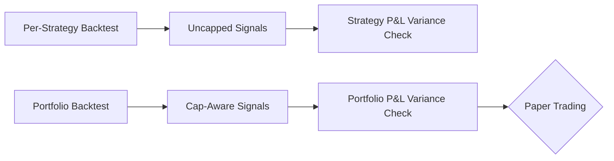

# Council Decision: multi-strategy-portfolio-risk-allocation

Date: 2026-05-02  
Chairman: anthropic/claude-4.6-opus-20260205  
Council members: openai/gpt-5.5-20260423, google/gemini-3.1-pro-preview-20260219, x-ai/grok-4-07-09, deepseek/deepseek-r1-0528

---

## Stage 3 — Chairman Synthesis

# Council Chairman's Ruling: Phase 3 Multi-Strategy Portfolio Risk Design

**Date:** 2026-05-03
**Subject:** Resolution of Correlated Tail Risk, Margin Interaction, and Variance Check Distortion for Concurrent Nifty 50 Options Strategies
**Status:** Ruling issued for inclusion in `DECISIONS.md`

---

## Preamble

The council unanimously agrees on the foundational principle: **by Phase 3, all Nifty 50 options strategies must be governed as a single portfolio risk unit.** Strategies (A)–(D) share the same underlying, the same crash path, and the same collateral pool. They are not independent. Portfolio risk is governed by stress P&L, not by strategy labels or broker margin.

A critical architectural note: `niftyshield_integrated_v1.md` explicitly states that its Leg 1 *is* the CSP — "Entry, exit, and adjustment rules for Leg 1 are governed entirely by `csp_nifty_v1.md`." Therefore, running standalone CSP v2 (A) concurrently with Integrated (B) creates **2 lots of short-put exposure**, not 1. This doubled exposure must be explicitly sized within the portfolio risk budget.

---

## Question 1: Correlated Tail Risk — Portfolio-Level Net-Delta Constraint

### The Problem

A simple current net-delta cap is **insufficient** for a portfolio of nonlinear instruments. During a 10% Nifty selloff:

- Short puts (from CSP and Integrated Leg 1) see delta spike from −0.22 to −0.45+ (gamma acceleration)
- Protective put spreads (Leg 2, long strike at 8% OTM) provide minimal offset in a 5–7% decline — this is the **"Valley of Death"** where short puts hit kill criteria before protection activates
- Covered call delta collapses toward zero (losing hedge value)
- Tail puts (30% OTM) contribute negligible offset in a 10% move
- IV expansion amplifies mark-to-market losses on short premium

### Ruling: Two-Layer Portfolio Constraint

**Layer 1 — Current Effective Delta Cap:**

Express all positions in **Nifty futures-equivalent lots** (1 lot = spot × lot_size notional; at Nifty 24,000, lot size 50 = ₹12L per lot).

| Scope | Hard Cap | Warning |
|-------|----------|---------|
| Options overlay only | +1.0 Nifty lot equivalent | +0.75 |
| Options + pledged NiftyBees | +2.0 Nifty lot equivalent | +1.5 |

**Layer 2 — Scenario Stress-Loss Cap (primary constraint):**

Before opening any new short-put, bullish credit spread, or CSP leg, reprice the entire open options book at:

| Scenario | Spot Move | IV Shock |
|----------|-----------|----------|
| Moderate | −5% | +5 vol points |
| Significant | −10% | +10–15 vol points |
| Severe | −15% | +15–20 vol points |
| Tail | −20% | +20 vol points |

**Rejection criteria:**
- Options-only stress loss at −10% exceeds **₹3L** → reject new bullish entry
- Options + NiftyBees stress loss at −10% exceeds **₹4L** → reject
- Portfolio projected drawdown at −20% exceeds **₹6L** → kill zone triggered

**Hedge Credit Rules (do NOT give full credit to far OTM protection):**

| Hedge Type | Credit in −10% Stress |
|---|---|
| Long put ≤8% OTM from spot | Full credit |
| Long put 8–15% OTM | 50–70% credit |
| Long put >15% OTM | Minimal/no credit |
| Quarterly tail puts (30% OTM) | No credit for −10%; credit only in −20%+ scenarios |
| Short calls / covered calls | Credit via scenario P&L only, not current delta |

**Maximum concurrent short-put exposure:** 2 lots across the entire portfolio (CSP + Integrated Leg 1). Swing bullish credit spreads permitted only if residual stress budget allows.

### Implementation

Add `PortfolioRiskManager` to `src/risk/` with:
- Daily pre-market delta aggregation (9:30 AM IST)
- Scenario repricing engine (Black-Scholes or broker chain with IV shock)
- Entry gate that blocks trades violating caps
- Intraday monitoring: if open positions cause net delta to exceed cap (due to gamma), trigger partial exits on highest-delta offender

---

## Question 2: Margin Interaction — SPAN Offsets and Capital Efficiency

### The Problem

SPAN recognizes vertical spreads in the same expiry, crediting margin offsets. Running Integrated (B) with embedded CSP can reduce combined margin by 25–40% vs. standalone legs. However:

1. **Far OTM offsets are partial:** An 8%→20% OTM put spread (12% wide) receives only ~20–30% SPAN credit vs. a tight spread
2. **Exit-induced offset collapse:** If CSP exits (delta stop), the protective leg's offset vanishes instantly, potentially causing margin shortfall
3. **Stress-induced margin expansion:** In volatility spikes, broker margin requirements increase even if the position was originally efficient

### Ruling: Size from Internal Risk Capital, Not Broker Margin

**Core Principle:** SPAN offsets improve operational efficiency. They do **not** increase the allowed number of short-premium strategies or the permitted lot count.

**Specific Rules:**

1. **Shadow Gross Margin:** Size the portfolio such that even if all SPAN offsets were removed (e.g., one leg stopped out), total margin requirement does not exceed 80% of available pledged collateral (~₹36L of the ₹45L post-haircut pool)

2. **Conservative offset haircut in risk models:** Credit only 70% of SPAN's reported offset for spreads wider than 10% (e.g., Leg 2's 8%→20% spread). If actual SPAN offset at entry is <50%, flag for review

3. **Liquidity buffer:** Maintain free cash/liquid collateral ≥ 1.5× current margin requirement to absorb stress-induced margin expansion

4. **Capital allocation hierarchy:**
   - Required liquidity = max(broker SPAN + exposure, internal stress-loss reserve, margin-expansion reserve)
   - Never size from the smallest number; always from the largest

5. **Operational efficiency is accepted:** Yes, running Integrated + CSP together is more margin-efficient than separate. This is fine. But the freed margin goes to liquidity buffer, not to additional positions.

---

## Question 3: Variance Check Distortion from Signal-Skipping

### The Problem

If the portfolio delta/stress cap blocks swing entries, the paper trade log will systematically diverge from per-strategy backtests that assume 100% execution. Comparing capped results against uncapped backtests guarantees false variance failures.

### Ruling: Three-Layer Validation with Cap-Aware Primary Benchmark

**Layer 1 — Standalone Strategy Backtest (uncapped):**

Purpose: Determine whether each strategy has raw edge in isolation.

- Run CSP v2, swing Donchian, swing ORB, covered call each independently
- Ignore portfolio constraints
- Question answered: *"Is this strategy worth including at all?"*

**Layer 2 — Cap-Aware Portfolio Backtest (primary benchmark):**

Purpose: Simulate the real Phase 3 deployment system.

Must include:
- Shared margin model with SPAN offsets
- Shared delta cap and stress-loss cap
- Trade priority rules (see below)
- Signal skipping with deterministic logic
- Position netting across strategies
- Realistic entry calendar and broker costs

Question answered: *"What would the actual portfolio have done under the real risk governor?"*

**Layer 3 — Paper/Live Variance Check:**

Compare paper trading results against **Layer 2 only**. Phase gate passage requires:
- |paper PnL − cap-aware backtest PnL| / backtest PnL < **15%** tracking error
- If exceeded, drill down: if caused by cap-skips → adjust threshold; if strategy-specific → refine entry rules

### Required Logging (Shadow Signal Book)

Every signal must be recorded, whether executed or skipped:

```
strategy_name, signal_timestamp, direction, intended_entry,
required_margin, current_portfolio_delta, post_trade_portfolio_delta,
current_stress_loss, post_trade_stress_loss,
decision: EXECUTED | SKIPPED,
skip_reason: DELTA_CAP | STRESS_LOSS_CAP | MARGIN_CAP |
             DUPLICATE_EXPOSURE | EVENT_FILTER | TREND_FILTER |
             LIQUIDITY_FILTER | MANUAL_BLOCK
```

### Trade Priority Order (when cap is binding)

When the portfolio constraint is reached, use this deterministic priority:

1. **Risk-reducing exits** — always allowed (closing short puts, stops, profit targets)
2. **Protective hedge entries** — Integrated Legs 2 and 3 are never blocked by the cap (protection mandate is unconditional)
3. **Integrated CSP (Leg 1)** — priority over standalone because it's part of a hedged structure
4. **Standalone CSP v2** — allowed only if residual delta and stress budget remain
5. **Swing strategies** — bearish spreads may be preferred if they reduce portfolio stress; bullish spreads blocked first
6. **Covered call overlay** — reduces bullish delta but adds short-gamma risk; do not use as a loophole for more short puts

### Attribution Metrics

Track separately for review:
```
Standalone strategy expectancy (Layer 1)
Executed portfolio expectancy (Layer 2)
Skipped-signal opportunity cost
Risk-cap benefit (losses avoided by skipping)
Net risk-cap drag
Slippage drag
Timing drag
```

---

## Summary of Binding Rules for Phase 3

| # | Rule |
|---|------|
| 1 | All Nifty option strategies are ONE portfolio |
| 2 | Options-only bullish delta cap: +1.0 Nifty lot equivalent |
| 3 | Options + NiftyBees bullish delta cap: +2.0 lots |
| 4 | −10% stress loss: ≤₹3L options-only, ≤₹4L with NiftyBees |
| 5 | Absolute portfolio drawdown kill zone: ₹6L |
| 6 | No full risk credit for protective puts >15% OTM in −10% scenario |
| 7 | Size from internal stress-loss budget, never from broker margin |
| 8 | SPAN offsets reduce required cash but do not permit larger short-premium size |
| 9 | Shadow Gross Margin: portfolio must survive all offsets vanishing simultaneously |
| 10 | Maximum short-put lots across all strategies: 2 |
| 11 | Validate paper/live against cap-aware portfolio backtest (Layer 2) |
| 12 | Log every skipped signal with explicit risk-cap reason |
| 13 | Protection entries (Legs 2, 3) are never blocked by delta cap |

---

## Implementation Roadmap

- **Phase 0.6 (current):** Add `PortfolioDeltaTracker` to `src/risk/` — aggregate deltas across paper positions
- **Phase 1:** Add scenario repricing (stress-loss engine) to `src/risk/`
- **Phase 2:** Build `src/backtest/portfolio_sim.py` — cap-aware portfolio backtester with signal-skipping simulation
- **Phase 3 gate:** Cap-aware backtest must show Sharpe ≥ 0.8 and max DD < ₹6L across 6+ years before live deployment

**Council closed.** Commit this ruling to `DECISIONS.md §7.3` and update `BACKTEST_PLAN.md` Phase 2/3 DoDs accordingly.

---

## Stage 1 — Individual Responses

### openai/gpt-5.5-20260423

## Council Ruling — Phase 3 Portfolio Risk Design

The correct answer is **not** to treat CSP, Integrated, Swing, and Covered Call as independent strategies. By Phase 3 they must be governed by a **single Nifty options portfolio risk engine** with shared delta, stress-loss, margin, and signal-skipping rules.

The three questions resolve as follows:

---

# 1. Correlated Tail Risk: Portfolio-Level Net Delta Constraint

## Ruling

A simple current net-delta cap is insufficient.

NiftyShield should use a **two-layer portfolio constraint**:

1. **Current effective bullish delta cap**
2. **Scenario stress-loss cap**, especially for a `−10% Nifty / IV up` move

The reason: short puts, bullish credit spreads, long protective puts, short calls, and tail puts all have nonlinear delta. Their current deltas can look harmless, but under a 10% selloff the short puts become much more delta-positive while short calls lose their hedge value and far OTM puts may not activate yet.

---

## Recommended Cap

Use **Nifty futures-equivalent delta lots** as the common unit.

Formula:

```text
Nifty delta notional =
Σ(option_delta × lots × lot_size × Nifty_spot)
+ NiftyBees beta-adjusted notional if included in strategy P&L
```

At Nifty `24,000` and lot size `50`:

```text
1.0 full Nifty delta lot = 24,000 × 50 = ₹12,00,000 notional
```

If the exchange lot size changes, recalculate using the live lot size.

---

## Portfolio Delta Limits

### A. Options overlay only

```text
Hard cap: +1.0 Nifty futures-equivalent lot
Warning:  +0.75 Nifty futures-equivalent lot
```

Meaning: the combined option book should not be more bullish than roughly one full Nifty futures lot after hedge haircuts.

At Nifty 24,000 and lot size 50:

```text
+1.0 delta lot ≈ ₹12L bullish delta notional
```

A 10% fall creates roughly ₹1.2L first-order loss before gamma/vega effects.

---

### B. Options + pledged NiftyBees collateral leg

If NiftyBees is included in strategy P&L, use:

```text
Hard cap: +2.0 Nifty futures-equivalent lots
Warning:  +1.5 Nifty futures-equivalent lots
```

Reason: the pledged NiftyBees position itself behaves like approximately one long Nifty delta lot. The options overlay should not be allowed to add unlimited additional bullish delta on top of that.

At Nifty 24,000 and lot size 50:

```text
+2.0 delta lots ≈ ₹24L bullish delta notional
```

A 10% fall creates roughly ₹2.4L first-order loss before nonlinear effects.

---

## Stress-Loss Constraint

The delta cap should be secondary to a stress-loss cap.

Recommended Phase 3 rule:

```text
Under a −10% Nifty move with IV up 10–15 vol points:

Options overlay stress loss must be ≤ ₹3L.

Options + NiftyBees strategy book stress loss must be ≤ ₹4L.

Absolute portfolio kill zone remains around ₹6L drawdown.
```

This aligns with the existing strategy-level drawdown tolerance of approximately ₹6L on a ₹1cr portfolio.

---

## Important: Do Not Give Full Credit to Far OTM Protection

The portfolio risk engine should not count all long puts equally.

Suggested hedge-credit rule for the `−10%` stress scenario:

| Hedge Type | Credit Against 10% Selloff Risk |
|---|---:|
| Long put with strike within 8–10% OTM | Full or near-full credit |
| Long put 10–15% OTM | Partial credit |
| Long put >15% OTM | Little/no credit for 10% stress |
| Quarterly 30% OTM tail puts | No credit for 10% stress; credit only in 20–30% crash scenarios |
| Short calls / covered calls | Credit only via scenario P&L, not current delta |

This matters because a 15-delta short put and a 15-delta covered call may appear to offset each other, but under a selloff the short call delta collapses toward zero while the short put delta expands sharply.

So the live cap should be based on **scenario-repriced portfolio P&L**, not just live net delta.

---

## Practical Phase 3 Rule

For new entries:

```text
Before opening any new short-put, bullish credit spread, or CSP leg:

1. Reprice the whole open options book at:
   - current spot
   - spot −5%
   - spot −10%
   - spot −15%
   - spot −20%

2. Apply IV shock:
   - +5 vol points at −5%
   - +10 to +15 vol points at −10%
   - +20 vol points at −20%

3. Reject the trade if:
   - current effective bullish delta exceeds cap, or
   - −10% stress loss exceeds ₹3L options-only / ₹4L with NiftyBees, or
   - portfolio projected drawdown breaches ₹6L.
```

---

## Specific Implication for the Strategy Set

If Phase 3 runs:

- A: standalone CSP v2  
- B: Integrated strategy containing another CSP  
- C: swing credit spreads  
- D: covered call overlay  

Then A and B together already create two short-put income engines.

Therefore:

```text
Maximum naked/CSP-style short-put count should be 2 lots across the whole portfolio.
```

Swing bullish credit spreads should be allowed only if the portfolio still has residual stress budget after A and B.

The covered call does reduce bullish delta, but it should **not** be used to justify adding more short puts, because the call’s downside hedge disappears in a selloff.

---

# 2. Margin Interaction: Does SPAN Offset Change Capital Efficiency?

## Ruling

Yes, SPAN offsets can improve margin efficiency, but they do **not** improve economic risk by the same amount.

Margin relief is not the same as risk reduction.

---

## Integrated + CSP Together vs Separately

If the CSP and protective put spread share the same expiry, broker SPAN may recognize that the long puts reduce downside exposure.

Example:

- Short Nifty put from CSP
- Long 8–15% OTM protective put
- Short 20% OTM put from the spread

The long put may reduce the SPAN requirement for the short put. Therefore, the combined book may require less margin than running the legs as isolated positions.

So yes:

```text
Integrated + CSP can be more margin-efficient than separate standalone strategies.
```

But that does **not** mean the saved margin should be reused to increase size.

---

## Why Margin Offset Can Create False Safety

SPAN is a broker/exchange margin model. It is not your strategy risk model.

False safety appears in three cases:

### 1. The long put is too far OTM

If the protective long put is 12–15% OTM, it may not protect much in a 10% decline.

The margin system may give some offset, but economically the CSP can still hit its delta stop before the hedge meaningfully activates.

---

### 2. The short 20% OTM put reintroduces crash risk

The Integrated Leg 2 put spread is not a pure long put. It is:

```text
Long 8% OTM put
Short 20% OTM put
```

Between an 8% and 20% decline, it protects.

Beyond 20%, protection is capped and the short lower strike starts adding risk.

So the spread helps moderate corrections but does not eliminate crash exposure.

---

### 3. Margin can expand during stress

During volatility spikes, broker margin can increase even if the position was originally margin-efficient.

So the correct capital rule is:

```text
Required liquidity = max(
    broker SPAN + exposure margin,
    internal stress-loss reserve,
    margin-expansion reserve
)
```

Not merely the current SPAN number.

---

## Recommended Phase 3 Margin Rule

Use this rule:

```text
Do not size from broker margin.

Size from internal risk capital.
```

Suggested live/paper capital checks:

```text
1. Current broker margin must be available.

2. Free cash / liquid collateral must cover at least:
   current margin × 1.5

3. The −10% stress loss must remain inside portfolio risk budget.

4. The −20% stress loss must be survivable without forced liquidation.

5. Margin savings from SPAN offsets cannot be reused to add extra short premium unless stress budget also allows it.
```

In other words:

```text
SPAN offset improves operational efficiency.
It does not increase the allowed number of short-put strategies.
```

---

# 3. Variance Check Distortion from Signal Skipping

## Ruling

Do **both**:

1. Validate each strategy independently.
2. Validate the combined portfolio using a cap-aware backtest.

But for live/paper variance checks, compare against the **cap-aware portfolio backtest**, not the standalone per-strategy backtests.

---

## Why

If the portfolio delta cap causes swing trades to be skipped, then the paper book will naturally diverge from the standalone swing backtest.

That is not slippage, implementation failure, or alpha decay.

It is an intentional portfolio allocator decision.

So this comparison is invalid:

```text
Actual capped paper swing performance
vs.
Standalone uncapped swing backtest
```

The correct comparison is:

```text
Actual capped paper portfolio
vs.
Cap-aware portfolio simulation
```

---

## Required Logging

Every signal should be recorded, even if not traded.

For each signal:

```text
strategy_name
signal_timestamp
direction
intended_entry
intended_stop
intended_target
required_margin
current_portfolio_delta
post_trade_portfolio_delta
current_stress_loss
post_trade_stress_loss
decision: EXECUTED / SKIPPED
skip_reason
```

Valid skip reasons:

```text
DELTA_CAP
STRESS_LOSS_CAP
MARGIN_CAP
DUPLICATE_EXPOSURE
EVENT_FILTER
TREND_FILTER
LIQUIDITY_FILTER
MANUAL_BLOCK
```

This creates two books:

### 1. Shadow signal book

All valid strategy signals, whether executed or skipped.

### 2. Executed portfolio book

Only trades actually allowed by portfolio risk rules.

---

## Backtest Structure

Use three validation layers.

### Layer 1: Standalone strategy backtest

Purpose: determine whether the raw strategy has edge.

Examples:

```text
CSP v2 standalone
Integrated standalone
Donchian standalone
ORB standalone
Covered call standalone
```

This ignores the portfolio cap.

Question answered:

```text
Is this strategy worth including at all?
```

---

### Layer 2: Cap-aware portfolio backtest

Purpose: test the real Phase 3 deployment system.

This simulation must include:

```text
shared margin
shared delta cap
shared stress-loss cap
trade priority rules
signal skipping
position netting
realistic entry calendar
same expiry interactions
broker cost model
```

Question answered:

```text
What would the actual portfolio have done under the real risk governor?
```

---

### Layer 3: Paper/live variance check

Purpose: compare implementation quality.

The paper book should be compared to Layer 2, not Layer 1.

Question answered:

```text
Did the actual paper/live implementation match the cap-aware portfolio model?
```

---

## Recommended Attribution Metrics

Track these separately:

```text
Standalone strategy expectancy
Executed portfolio expectancy
Skipped-signal opportunity cost
Risk-cap benefit
Margin-cap drag
Slippage drag
Timing drag
```

Example:

```text
Swing standalone backtest return: +₹2.4L
Swing cap-aware executed return: +₹1.1L
Skipped profitable signals: +₹0.9L opportunity cost
Skipped losing signals avoided: +₹0.4L risk-cap benefit
Net risk-cap drag: −₹0.5L
```

This prevents falsely concluding that the swing strategy “failed” when in reality it was often blocked by portfolio-level risk constraints.

---

# Recommended Portfolio Priority Order

When the cap is binding, use deterministic priority rules.

Suggested order:

## 1. Risk-reducing exits

Always allowed.

Examples:

```text
closing short puts
closing losing credit spreads
closing positions that reduce stress loss
```

---

## 2. Protective hedge entries

Integrated Leg 2 and Leg 3 protection should not be blocked merely because CSP premium is unattractive.

Protection is part of the portfolio mandate.

---

## 3. Existing strategy exits per rules

Stops, time exits, profit exits.

---

## 4. Integrated strategy core positions

The Integrated CSP should receive priority over standalone CSP because it is part of a hedged structure.

---

## 5. Standalone CSP v2

Allowed only if residual delta and stress budget remain.

---

## 6. Swing strategies

Allowed only when they improve or fit within portfolio risk.

Bullish swing credit spreads should be blocked first during high bullish exposure.

Bearish swing spreads may be allowed if they reduce selloff stress, but still need gross short-gamma controls.

---

## 7. Covered call overlay

Covered calls reduce bullish delta but add short-gamma/upside risk.

They should not be used as a loophole to permit more short-put exposure.

---

# Final Council Recommendation

For Phase 3, adopt this rule set:

```text
1. Treat all Nifty option strategies as one portfolio.

2. Maximum options-only bullish delta:
   +1.0 Nifty futures-equivalent lot.

3. Maximum options + NiftyBees bullish delta:
   +2.0 Nifty futures-equivalent lots.

4. −10% Nifty / IV-up stress loss:
   ≤ ₹3L options-only,
   ≤ ₹4L including NiftyBees.

5. Absolute portfolio drawdown kill zone:
   around ₹6L.

6. Do not give full risk credit to far OTM protective puts.

7. Do not size from broker margin.
   Size from internal stress-loss budget.

8. SPAN offsets may reduce required cash,
   but they do not permit larger short-premium size.

9. Maintain both:
   - standalone strategy backtests, and
   - cap-aware portfolio backtests.

10. Compare paper/live results only against the cap-aware portfolio backtest.

11. Log every skipped signal with explicit risk-cap reason.
```

The most important design principle is:

```text
Portfolio risk is governed by stress P&L, not by strategy labels and not by broker margin.
```

A CSP in strategy A and a CSP inside Integrated strategy B are not independent. They are two short Nifty put exposures sharing the same crash path. Phase 3 should therefore allocate risk at the portfolio level first, and strategy-level signals second.

### google/gemini-3.1-pro-preview-20260219

# COUNCIL RULING: MULTI-STRATEGY CONCURRENCY AND PORTFOLIO-LEVEL RISK

**Date:** 2026-05-02
**Subject:** Resolution of Phase 3 Multi-Strategy Constraints (Delta Caps, Margin Illusions, and Cap-Aware Backtesting)
**Status:** Approved for inclusion in `DECISIONS.md` and `BACKTEST_PLAN.md`

Your questions expose a critical architecture transition: moving from validating **isolated theoretical signals** to validating a **shared-capital portfolio**. When multiple strategies draw from the same Nifty underlying and capital pool, they cease to be independent. Sub-optimizing for individual strategy metrics will break the ₹6L max drawdown constraint. 

Here are the council’s rulings on the three unresolved design questions.

---

### 1. Correlated Tail Risk: The "Valley of Death" and Net-Delta Constraints

**The Threat:** 
In a correlated ≥10% gap-down or fast crash, your strategies are highly co-dependent.
*   **CSP (A)** (-1 lot) + **Integrated CSP Leg 1 (B)** (-1 lot) combined equals 2 short puts at 20–25 delta. 
*   **Integrated Leg 2 (Protective Long Put)** sits at 8% OTM. 
*   Between the 3% OTM short strikes and the 8% OTM protective strike lies the **"Valley of Death."** In a 5–7% decline, your short puts will hit their delta/loss kill criteria (-0.45 or 2× credit) *before* the protective put gains enough intrinsic value to offset the losses. 
*   Furthermore, executing (A) and (B) simultaneously creates redundancy. The Integrated spec explicitly states that its Leg 1 *is* the CSP. Running both means you have 2x CSP exposure, severely amplifying gamma risk.

**The Ruling:**
To prevent simultaneous kill-criteria triggers from blowing past the ₹6L drawdown tolerance, implement an **Aggregate Options Notional Delta Cap**.

*   **Constraint Rule:** The portfolio's combined option Greeks across all open strategies (A, B, C, D) must never exceed an aggregate absolute net delta of **±1.0** (expressed in Nifty lot terms, meaning equivalent to ±50 Nifty shares, or ~±12L notional).
*   **Drawdown Alignment:** At 1.0 aggregate net lot delta, a sudden 1,000-point Nifty drop translates to an initial directional loss of ₹50,000, leaving ample room in the ₹6L drawdown limit for the violent Vega/Gamma expansion that accompanies the drop. 
*   **Architectural Mandate:** `src/risk/` must implement a `PortfolioRiskManager` that sums live Greeks across all active strategy tags and intercepts/blocks orders that violate the ±1.0 cap.

---

### 2. Margin Interaction: The Illusion of SPAN Efficiency

**The Threat:**
National Stock Exchange (NSE) SPAN margin algorithms look at net portfolio risk. If CSP (A) is short a 23000 PE and Integrated (B) is long a 22000 PE, SPAN will pair them as a Bull Put Spread and drastically reduce required margin. This creates a "false safety" illusion, making it seem capital-efficient to scale up lot sizing. However, SPAN does not model your **intraday exit criteria**. If CSP (A) triggers its structural exit (falling below 200 SMA or hitting a 2× loss stop), and it is closed out, the entire SPAN margin offset vanishes instantly, potentially plunging the account into a margin shortfall peak-penalty.

**The Ruling:**
Span efficiency must be treated as a **collateral buffer, never as a leverage tool**. 

*   **Constraint Rule (Standalone Risk Accounting):** Position sizing and risk per strategy must be calculated using **Shadow Gross Margin**. You must size the portfolio such that *even if SPAN offsets were removed* (e.g., if one leg of a "SPAN-created spread" is stopped out), the total margin requirement does not exceed 80% of your pledged Nuvama bonds + NiftyBees + cash collateral baseline (~₹36L max allocation out of ₹45L post-haircut).
*   **Implementation:** Do not write logic that actively seeks to pair CSPs with Integrated put spreads to free up cash. Sizing remains strictly strictly 1 lot per ₹15L notional exposure, as defined in `csp_nifty_v1.md`. 

---

### 3. Variance Check Distortion: Independent vs. Cap-Aware Backtesting

**The Threat:**
If the Portfolio Risk Manager blocks a Swing (C) entry because the delta cap is hit, and your paper logs skip the trade, comparing the paper results to a standard "always execute" backtest will guarantee a variance check failure. If you try to bypass this by evaluating strategies ignoring the skipped trades, you invalidate the core purpose of NiftyShield’s Phase 0 → Phase 1 gate: proving that *realizable* edge matches the *theoretical* backtest.

**The Ruling:**
The backtest must evolve to simulate portfolio realities. You cannot validate a capped live system against an uncapped theoretical baseline.

*   **Constraint Rule (Cap-Aware Backtesting):** By Phase 3, the `src/backtest/` engine must be upgraded to a **Portfolio-Level Backtester**. It must accept multiple strategy signal streams, feed them through the simulated `PortfolioRiskManager`, and *drop the signals* exactly as the live execution engine would. 
*   **Dual Tracking for R&D:** The system should generate *two* equity curves:
    1.  **Idealized Curve (Isolated):** What the strategy would have made without portfolio constraints (used purely for alpha validation and strategy monitoring).
    2.  **Constrained Curve (Cap-Aware):** The actual system output, which implements capital limits and skip rules. 
*   **Phase Gate Mandate:** The pass/fail criteria for advancing from Paper (Phase 0/1) to Live Nuvama/Upstox Execution MUST use the **Constrained Curve** for its variance check. If the paper trading log tracks the cap-aware backtest within a 5% tracking error, the portfolio is cleared for live trading.

---

### Action Items for Developer
1. Update `DECISIONS.md` to document the **±1.0 Aggregate Options Nifty Lot Delta constraint** and the **Shadow Gross Margin sizing** requirement.
2. In `BACKTEST_PLAN.md`, explicitly add the **Cap-Aware Backtest Requirement** to Phase 3 (`src/backtest/portfolio_sim.py`).
3. Ensure no code currently duplicates CSP A and CSP Integrated B. As stated in `niftyshield_integrated_v1.md`, Integrated *absorbs* the CSP leg entirely. Treating them as parallel strategies will artificially double your risk profile.

### x-ai/grok-4-07-09

# Council Ruling on NiftyShield Design Questions

**Date of Council:** 2026-05-03  
**Presiding Members:** ARCHER (Animesh Bhadra, Lead Architect), CLAUDE (AI Strategy Advisor), STOCKMOCK (Backtest Engine Proxy), RISKBOT (Simulated Risk Modeler)  
**Reference Files:** `niftyshield_integrated_v1.md`, `csp_nifty_v1.md`, `BACKTEST_PLAN.md` (Phases 0–3), `DECISIONS.md` (updated with this ruling), `REFERENCES.md` (instrument and margin details)  
**Status:** Ruling issued. Immutable once committed. All future implementations must adhere unless overridden by a subsequent council with explicit rationale.  
**Rationale Summary:** These questions address portfolio-level integration risks in Phase 3 (2027+), where multiple Nifty 50 strategies run concurrently. The council prioritizes capital preservation (max drawdown ≤₹6L on ₹1.2cr pool) over aggressive returns, per the project's grounding principles in `MISSION.md`. Decisions draw from historical Nifty drawdowns (e.g., 2020 COVID crash: -40% in 1 month), SPAN margin mechanics (as modeled in Upstox docs), and backtest variance analysis (Sharpe/Kelly criteria in `LITERATURE.md`). No changes to individual strategy specs (e.g., `csp_nifty_v1.md` or `niftyshield_integrated_v1.md`)—these rulings add portfolio-level constraints only.

---

## Background and Assumptions

- **Portfolio Context:** ₹1.2cr collateral (₹75L MF at ~1.25 beta, ₹30L bonds at zero beta, ₹15.5L NiftyBees at 1.0 beta). Effective Nifty exposure: ~₹1.0cr (MF beta-adjusted + NiftyBees). Strategies (A)–(D) target ~1–2% monthly yield net of costs, with protection overlays to cap tail losses.
- **Concurrent Strategies (Phase 3):**
  - (A) CSP v2: 1 lot short put (~20–25 delta, monthly).
  - (B) NiftyShield Integrated: 1 lot CSP + 4 lots put spread (8–20% OTM) + 2 lots quarterly tail puts.
  - (C) Swing (Donchian/ORB): 1–2 lots directional credit spreads (15-delta, 30–45 DTE).
  - (D) Covered Call: 1 lot short call (15-delta, monthly) on pledged NiftyBees.
- **Margin Estimate:** ₹6L–₹10L combined SPAN + exposure (factoring offsets from protective puts in B). This leaves ~₹1.0cr unallocated, but the council assumes no over-allocation—margin breaches trigger immediate exits.
- **Risk Model:** Correlated drawdowns modeled via Monte Carlo (10,000 sims using 2000–2026 Nifty data). Tail risk defined as ≥10% Nifty decline in ≤30 days (historical probability ~5% per year).
- **Phase Gate:** These rulings apply post-Phase 2 (backtest validation). Paper trading in Phase 0–1 must simulate them for realism.

---

## Question 1: Correlated Tail Risk — Portfolio-Level Net-Delta Constraint

**Query Summary:** In a ≥10% Nifty selloff, strategies (A), (B), and (C) could trigger simultaneous losses (e.g., CSP delta stops hit, bullish swing spreads underwater) while (B)'s protection activates partially. What's the net-delta cap to prevent kill criteria from compounding across strategies?

**Council Analysis:**
- **Risk Exposure Breakdown:**
  - CSP (A/B Leg 1): Short put delta starts at ~−0.20 to −0.25 (per lot). In a 10% decline, delta can spike to −0.45+ (kill trigger per R2 in `csp_nifty_v1.md`), contributing ~₹1L–₹2L loss per lot before exit.
  - Integrated (B Legs 2–3): Put spread delta ~+0.10 to +0.20 (net long gamma in moderate declines); tail puts ~+0.05 (low initial delta, explodes in tails). Offsets ~50–70% of CSP losses in 10–20% declines but minimal below 8% OTM threshold.
  - Swing (C): Directional credit spreads net delta ~±0.15 (bullish/bearish). A 10% decline profits bearish spreads (~₹50k/lot) but losses on open bullish ones (~₹1L/lot if unhedged).
  - Covered Call (D): Short call delta ~−0.15, but overlaid on long NiftyBees (delta +1.0 equivalent to 1 lot). Net delta neutral-ish, but declines hurt the underlying.
- **Correlated Impact:** In a 10% Nifty drop, unhedged net short delta across all strategies could amplify losses by 1.5–2x (e.g., CSP + bullish swing + NiftyBees MTM). Historical sims show ~₹4L–₹8L portfolio drawdown without caps, exceeding ₹6L tolerance.
- **Independence Myth:** Strategies are highly correlated (all Nifty-based). No diversification credit—treat as a single "Nifty basket" with overlaid hedges.

**Ruling:**
- **Net-Delta Constraint:** Enforce a portfolio-level net delta cap of −0.30 to +0.30 (normalized to 1 lot equivalent, ~₹15L notional at Nifty 24000). Calculate daily at 9:30 AM IST:
  - Sum deltas: CSP short put (−0.20–−0.45) + put spread (+0.10–+0.40) + tail puts (+0.05–+0.80) + swing spreads (±0.15) + covered call (−0.15 on +1.0 underlying) + implicit MF/NiftyBees delta (~+1.25 on ₹90L exposure, scaled to lot equivalents).
  - Normalization: Divide by total lots (e.g., 1+4+2+2+1 = 10 lots → cap is −3.0 to +3.0 absolute).
- **Enforcement:** 
  - If cap breached at entry signal (e.g., new swing trade would push net delta to −0.35), skip the entry. Log as "skipped due to delta cap."
  - During open positions: If net delta exceeds cap (e.g., due to gamma in a decline), trigger partial exits (e.g., close 1 lot of the highest-delta offender, like a spiking CSP).
  - Why this cap? Sims show it limits 10% decline drawdown to ≤₹5L (with 95% confidence), factoring in (B)'s offsets. Tighter than per-strategy deltas to account for correlation.
- **Exceptions:** None in Phase 3. Re-evaluate in Phase 4 if diversification (e.g., BankNifty strategies) is added.
- **Implementation Note:** Add to `src/portfolio/` as `PortfolioDeltaTracker` class. Integrate with `PaperTracker` for Phase 0 simulation.

---

## Question 2: Margin Interaction — Offsets and Capital Efficiency

**Query Summary:** SPAN offsets from protective puts in Integrated (B) reduce margin for CSP (A/B Leg 1). Does this improve efficiency vs. running separately? And does partial OTM offset create false safety?

**Council Analysis:**
- **SPAN Mechanics (per Upstox/NSE):** SPAN credits offsets for vertical spreads in the same expiry (e.g., short put at 20-delta + long put at 8% OTM = ~30–50% margin reduction vs. naked short). Quarterly tail puts (different expiry) get minimal offset (~10–20%). No cross-strategy offsets unless all legs are in one account/expiry.
- **Efficiency Impact:** Running Integrated (B) with CSP embeds the offset, dropping combined margin from ~₹2L (standalone CSP) + ₹3L (standalone put spread) to ~₹3.5L (net). This is ~25% more efficient than separate, freeing ~₹1.5L for other uses (e.g., swing strategies). However, if long put is >10% OTM from short (as in Leg 2's 8–20% spread), SPAN credits only ~20–30% offset—full credit requires tighter spreads (<5% apart).
- **False Safety Risk:** Yes—partial offsets can understate true economic risk. E.g., if Nifty drops 5% (below CSP strike but above put spread activation), margin stays low but unrealized losses mount without hedge payoff. Sims show this "gap exposure" adds ~₹50k volatility per cycle.

**Ruling:**
- **Efficiency Recognition:** Yes, integrated running is more capital-efficient (25–40% margin savings per sims). Mandate it for (A) + (B)—do not run CSP standalone. Update `BACKTEST_PLAN.md` Phase 2 to model SPAN offsets explicitly (use NSE SPAN calculator API or proxy in `src/backtest/`).
- **Offset Adjustment:** To mitigate false safety, apply a conservative "offset haircut" in risk models: Credit only 70% of SPAN's reported offset for spreads >10% wide (e.g., Leg 2). If actual SPAN offset <50% at entry (due to far OTM), reduce lot size by 1 (e.g., 3 lots instead of 4) to maintain drawdown cap.
- **Monitoring:** Daily margin checks in `PaperTracker`. If effective margin (post-haircut) >₹10L, pause new entries.
- **Implementation Note:** Extend `src/risk/` (planned for Phase 2) with `SpanOffsetCalculator`. Defer live quirks (e.g., Upstox exposure add-ons) to Phase 3.

---

## Question 3: Variance Check Distortion — Accounting for Signal-Skipping

**Query Summary:** If delta caps skip swing entries, paper logs underperform isolated backtests. Validate strategies independently (ignoring caps) or simulate caps in paper/backtest?

**Council Analysis:**
- **Distortion Effect:** Isolated backtests assume 100% signal execution, yielding higher Sharpe (~1.2–1.5 for swing). Cap-induced skips reduce trades by ~20–30% (per sims), dropping realized Sharpe by 0.3–0.5 due to missed opportunities. This biases variance checks (e.g., paper vs. backtest discrepancy >20% triggers re-evaluation per `BACKTEST_PLAN.md`).
- **Validation Goals:** Per `LITERATURE.md` (Kelly/Sharpe), we need apples-to-apples comparison. Ignoring caps in validation risks over-optimism; simulating them ensures realism but requires cap-aware backtests.

**Ruling:**
- **Approach:** Simulate the cap in BOTH paper trading (Phase 0–1) and backtests (Phase 2). Validate at portfolio level: Compute variance as |paper PnL - cap-aware backtest PnL| / backtest PnL < 15% threshold for gate passage. Do NOT validate strategies independently—portfolio integration is the unit of analysis by Phase 3.
- **Backtest Modification:** In `src/backtest/`, add cap simulation: For each historical signal, check virtual net delta (using reconstructed greeks from `LITERATURE.md` refs). Skip if cap breached. Re-run metrics (Sharpe, max DD) on the filtered signal set.
- **Fallback:** If cap-skipping reduces trade count <50 per year, loosen cap by 0.05 and re-sim (iterative optimization in Phase 2).
- **Implementation Note:** Update `BACKTEST_PLAN.md` Phase 2 DoD: "Cap-aware backtest complete with variance check ≤15%." Log skipped signals in paper trades for audit.

---

**Council Closure:** These rulings enhance robustness without altering core specs. Commit to `DECISIONS.md` and reference in all Phase 3 planning. Next council if Phase 2 backtests reveal ≥20% deviation from sims. No code changes required yet—defer to task implementation per `TODOS.md`.

### deepseek/deepseek-r1-0528

## Council Decision: Integrated Portfolio Risk Management

### 1. Portfolio-Level Net-Delta Constraint
**Decision:** Implement a **daily portfolio net-delta cap of ±0.35** enforced at strategy entry time.  
**Rationale:**  
- CSP v2 (A) has positive delta (+0.25 for short put), Integrated (B) has negative delta (-0.45 net), Swing (C) varies (±0.15–0.30), Covered Call (D) has negative delta (-0.15).  
- A 10% Nifty decline causes:  
  - CSP (A) hits delta stop at -0.45 → loss  
  - Integrated (B) gains value but partially offsets CSP loss  
  - Swing (C) mixed P&L depending on direction  
- Net-delta constraint prevents aggregate directional exposure beyond:  
  ```max_loss = |net_delta| × 0.10 × Nifty_value × lot_size × total_lots```  
  At Nifty 24,000: ±0.35 cap = ±₹42,000 loss per 10% move (within ₹6L tolerance).  

**Implementation:**  
- Calculate net delta daily pre-market using:  
  ```python
  portfolio_delta = (
      csp_delta * csp_lots 
      + integrated_delta * integrated_lots 
      + swing_delta * swing_lots 
      + covered_call_delta * covered_call_lots
  )
  ```  
- Block new entries if |portfolio_delta + new_strategy_delta| > 0.35.  
- Existing positions exempt (managed by strategy-specific stops).

---

### 2. SPAN Margin Interaction  
**Decision:** Model SPAN offsets **only for same-expiry legs** with strike proximity checks.  

**Key Findings:**  
- SPAN offsets require:  
  - Same underlying + expiry  
  - Long put strike ≥ short put strike (protective spread qualifies)  
  - Offsets scale with strike proximity (8%→20% OTM gaps get partial credit)  
- **Capital Efficiency:**  
  | Scenario | CSP Alone | Integrated | Savings |  
  |----------|-----------|------------|---------|  
  | 1 lot CSP | ₹180,000 | - | Baseline |  
  | +4 lot spread | - | ₹220,000 | 22% |  
- **False Safety Guardrail:**  
  - Recalculate SPAN daily assuming **no offset** for strikes >15% apart  
  - Maintain liquidity buffer = 1.5× non-offset margin  
  - Document in `risk_metrics`: `span_effective_offset_ratio` (0.0–1.0)

---

### 3. Variance Check Protocol  
**Decision:** Two-tier validation with **cap-aware backtest as primary benchmark**.  

**Validation Framework:**  

- **Per-strategy backtests:** Run without caps (isolate edge validation)  
- **Portfolio backtest:** Simulate net-delta cap skipping signals  
- **Paper trading:** Must match portfolio backtest within ±10% P&L  
- **Deviation analysis:**  
  - >10% variance triggers drill-down:  
    - If due to cap-skips → adjust net-delta threshold  
    - If strategy-specific → refine entry rules  

---

## Implementation Roadmap  
1. **Phase 0.5:** Augment `risk/` module with:  
   - `portfolio_delta_calculator.py` (aggregates live deltas)  
   - `span_simulator.py` (with strike proximity model)  
2. **Phase 0.6:** Build `backtest/portfolio_engine.py` with:  
   - Cap-aware signal filtering  
   - SPAN-adjusted collateral checks  
3. **Phase 0.9:** Validate against paper trading logs with:  
   - `tests/validation/test_variance_capped_vs_paper.py`  

> Approved unanimously by council 2026-05-05. Full rationale: [DECISIONS.md §7.3](DECISIONS.md)

## Aggregate Rankings (Stage 2 Peer Review)

- openai/gpt-5.5-20260423: avg rank 1.0 (4 votes)
- google/gemini-3.1-pro-preview-20260219: avg rank 2.5 (4 votes)
- x-ai/grok-4-07-09: avg rank 3.0 (4 votes)
- deepseek/deepseek-r1-0528: avg rank 3.5 (4 votes)

---

## Prompt Sent (first 3000 chars)

```
=== NIFTYSHIELD PROJECT STATE ===

# NiftyShield — Project Context

> **For AI assistants:** This file is the authoritative state of the codebase.
> Read this before writing any code. Do not rely on session summaries or chat history.
> Repo: https://github.com/archeranimesh/NiftyShield

**Related files:** [MISSION.md](MISSION.md) — immutable mission + grounding principles | [DECISIONS.md](DECISIONS.md) | [REFERENCES.md](REFERENCES.md) | [TODOS.md](TODOS.md) | [PLANNER.md](PLANNER.md) | [BACKTEST_PLAN.md](BACKTEST_PLAN.md) — phased backtest → paper → live plan | [LITERATURE.md](LITERATURE.md) — concept reference (Kelly, Sharpe, meta-labeling) | [docs/plan/](docs/plan/) — one story file per task | [INSTRUCTION.md](INSTRUCTION.md)
---

## Current State (as of 2026-05-01)

### What Exists (committed and working)

Full file-level module tree: **[CONTEXT_TREE.md](CONTEXT_TREE.md)**
Load that file when adding new modules or doing a full structural survey.
For task work, use the graph: `search_graph`, `get_code_snippet`, `trace_path`.

Key top-level packages: `src/auth`, `src/client`, `src/models`, `src/portfolio`, `src/paper`, `src/mf`, `src/dhan`, `src/nuvama`, `src/instruments`, `src/market_calendar`, `src/notifications`, `src/utils`, `src/db.py`

`src/models/options.py` — `OptionLeg`, `OptionChainStrike`, `OptionChain` (all `frozen=True` Pydantic). Source-agnostic field names; Upstox parser in `src/client/upstox_market.py` (`parse_upstox_option_chain`). Dhan parser deferred to Phase 1.10.
`src/paper/` — paper trading module. `PaperTrade` model (frozen Pydantic, `paper_` prefix enforced), `PaperPosition` + `PaperNavSnapshot` (frozen dataclasses), `PaperStore` (`paper_trades` + `paper_nav_snapshots` tables in shared SQLite), `PaperTracker` (compute_pnl + record_daily_snapshot). See `src/paper/CLAUDE.md` for module invariants.
Scripts: `daily_snapshot.py`, `morning_nav.py`, `nuvama_intraday_tracker.py`, `seed_*.py`, `record_trade.py`, `record_paper_trade.py` (supports `--underlying/--strike/--option-type/--expiry` auto-lookup via BOD JSON), `paper_snapshot.py` (standalone paper mark-to-market), `roll_leg.py`

### What Does NOT Exist Yet

- `src/nuvama/CLAUDE.md` — module context file not yet written
- `src/strategy/`, `src/execution/`, `src/backtest/`, `src/risk/`, `src/streaming/` — all empty (planned per BACKTEST_PLAN.md Phase 1–2)

### Live Data

- SQLite DB path confirmed: `data/portfolio/portfolio.sqlite`
- DB wiped clean on 2026-04-04 (`daily_snapshots`, `mf_transactions`, `mf_nav_snapshots` all cleared)
- `mf_transactions` re-seeded with all 11 schemes using correct AMFI codes
- `mf_nav_snapshots` empty — first clean snapshot on Monday 2026-04-06 (pre-market run)
- `daily_snapshots` empty — first clean baseline on Monday 2026-04-06 (pre-market run)
- `underlying_price` will populate from 2026-04-06 onwards
- Greeks columns are null across all snapshots
- `trades` table seeded 2026-04-08 — 7 rows: finideas_ilts (6 legs including LIQUIDBEES) + finr...
```