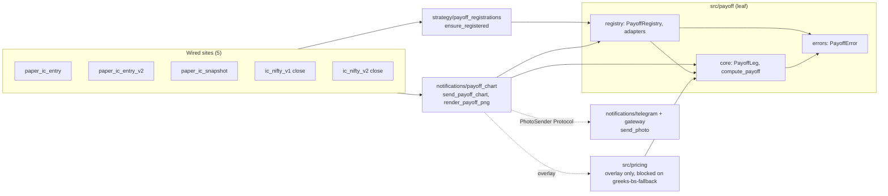

# Strategy Payoff Charts — epic index

> Attach a Stockmock-style payoff diagram to the Telegram messages that already carry each position through its lifecycle: at entry, in the daily EOD audit, and at close. Built strategy-agnostic — any
> strategy gets its chart by registering itself in an opt-in registry. Iron Condors (one PNG per variation) are the first and, in this epic, the only wired strategy. It is one epic rather than one
> story because the full-parity chart (blue T+0 curve, ±1σ/±2σ bands, POP) needs a Black-Scholes pricer + implied-vol solver that a *separate* not-yet-started story (`greeks-bs-fallback/`) already
> owns, so the model-driven overlay is split off and blocked on that story while everything that needs no option model ships first.

## Why this epic exists

Requested by Animesh (2026-09-09 session); generalised from Iron-Condor-only to any strategy and renamed from `ic-payoff-charts/` on 2026-10-03. The paper-strategy Telegram messages are text-only
today — leg tables, Greeks, captured-credit %. A payoff diagram gives an at-a-glance read of where spot sits relative to the breakevens and short strikes and how much of the credit is banked. The
reference is Stockmock's "Payoff Chart" tab: expiry payoff, a T+0 mark-to-market curve, ±1σ/±2σ expected-move bands, and a stat header (Max Profit, Max Loss, R:R, POP, Net Credit, Breakevens, Est.
Margin).

Nothing in the repo sends images (every Telegram path is text-only `sendMessage`) or plots anything (no matplotlib). The full-parity chart also needs per-leg option pricing on a non-expiry date, which
needs a Black-Scholes model — and Upstox returns `iv = 0.0` on every strike for the yearly/leaps bucket, so an implied-vol solver is required to cover all variations. That pricer + solver is the
decided scope of `greeks-bs-fallback/` (new `src/pricing/` package), not this epic.

## Scope decisions

- **Epic with two sub-stories** (confirmed with Animesh, 2026-09-09). `chart-core/` — the generic expiry payoff chart + registry + image-send plumbing + IC lifecycle wiring, no option model, ships
  immediately. `chart-model-overlay/` — the T+0 curve + σ bands + POP, blocked on `greeks-bs-fallback/`.
- **Strategy-agnostic with an opt-in registry** (confirmed, 2026-10-03). Payoff math runs on a generic leg list (`PayoffLeg`: strike, kind CE/PE/FUT/EQ, signed qty, entry price), not on IC strikes. A
  strategy opts in with `@register_payoff("<strategy_name>")` — the default adapter derives legs from its open `PaperPosition`s, and a custom `PayoffAdapter` is written only when that is not enough.
  Unregistered ⇒ no chart and no error. Iron Condors V1 + V2 register explicitly in this epic; every future strategy registers during its own development. No implicit auto-coverage.
- **Acceptance structures** (confirmed, 2026-10-03): Iron Condor, Cash-Secured Put, Covered Call, Collar — hand-computed fixtures (`chart-core/` PC-4) prove the "any strategy" math before rendering or
  wiring is built on it. CSP / CC / Collar are tests of the math only; they are not wired to Telegram in this epic.
- **Unbounded payoffs** are reported, not invented: `max_profit` / `max_loss` is `None` and renders as "Unlimited" when the payoff slope past the highest strike is non-zero.
- **One PNG per variation** (confirmed) — a separate photo after each variation's text report, not a combined image and not a Telegram media group.
- **Full parity with the Stockmock reference** is the target for the finished epic (confirmed).
- **The three modeling decisions** the overlay needs — risk-free rate, time-to-expiry convention, delta tolerance — are **owned by `greeks-bs-fallback/` GF-1** and inherited here, not re-decided
  (confirmed, 2026-09-09).
- **Tasks kept small** — 1–2 files each (confirmed) — hence 19 tasks in `chart-core/` and 9 in `chart-model-overlay/` rather than a handful of large ones.
- **matplotlib** is the plotting library (confirmed). Agg backend, render to an in-memory PNG buffer. No `scipy` — `math.erf` covers the normal CDF.
- **Est. Margin** is shown only when a `MarginSnapshot` exists for the strategy — it is captured post-entry and OAuth-token-gated, so it is absent at entry and that stat is simply omitted then.
- **No DB schema change** — this epic only reads existing tables. No `schema.md`.

## Stories

| Story | Purpose | Status | Depends on | Closing SHA |
|---|---|---|---|---|
| `chart-core/` | Generic payoff math + opt-in registry + matplotlib renderer + `send_photo` + IC registration and wiring (entry / EOD / close) | ✅ Done (`6ef2a5f`) | — | `6ef2a5f` |
| `chart-model-overlay/` | Blue T+0 curve, ±1σ/±2σ bands, POP for any registered strategy; adapters supply per-leg IV + DTE | ⬜ Not started | `chart-core/` done + `greeks-bs-fallback/` GF-2/GF-3 | — |

Status: ⬜ Not started · 🔄 In progress · ✅ Done. This column is the epic's progress view — per-task checkboxes live only in each sub-story's `tasks.md`.

Story order is fixed and is the row order above. `chart-core/` has no external dependency and can start now. `chart-model-overlay/` must not begin until `src/pricing/black_scholes.py` (GF-2) and
`src/pricing/implied_vol.py` (GF-3) exist and `chart-core/` is complete.

## Cross-cutting constraints

- **Non-fatal send contract** (`src/notifications/CLAUDE.md`) — `TelegramNotifier.send()` / `TelegramGateway.send_notification` are called from `try/except` throughout the strategy layer; a
  notification failure must never raise into strategy logic. `send_photo` and `send_payoff_chart` inherit this exactly: a failed photo send logs a warning and returns, never raises.
- **Chart send is additive, never a replacement** — the existing text message is unchanged; the PNG is a follow-up send. `sendPhoto`'s caption cap is 1024 chars, well under the current message sizes,
  so the photo carries a short caption or none.
- **The renderer degrades, never errors** — a missing spot, missing DTE, missing margin, an unbounded side, or (in the overlay) an unsolvable IV drops that one element from the chart; the expiry
  payoff line always renders for any non-empty leg set.
- **Registration is opt-in and explicit** — nothing is charted implicitly; a duplicate registration raises (never a silent override).
- **`Decimal` for money** in the payoff math (`src/payoff/`). The pricing helpers (`src/pricing/`, overlay only) are `float` by the `greeks-bs-fallback/` decision — charting and probability only,
  never a persisted money path.
- **Message budget** — `TelegramNotifier`'s per-session budget (default 10) must not let photos starve text in the EOD snapshot run (~8 variants → ~8 text + ~8 photos). PC-9 addresses this.
- **`greeks-analyst` is a blocking review gate** for every task that touches `paper_ic_snapshot.py`, the `IronCondor*` strategy classes, or option-chain IV.

## Supersession / coordination

- **`greeks-bs-fallback/`** — hard dependency for `chart-model-overlay/`. That story builds `src/pricing/black_scholes.py` (GF-2: call/put price + delta) and `src/pricing/implied_vol.py` (GF-3:
  Newton-Raphson IV solver). The overlay consumes both. Before starting any `MO-*` task, confirm GF-2 and GF-3 are ticked in `docs/plan/greeks-bs-fallback/tasks.md`. Do not build a second pricer here.
- **`paper_ic_snapshot.py` dead-query cleanup** — `TODOS.md ## Feature Backlog` item 15 ("Fix dead IC EOD report query") touches the same file PC-16 wires into. Unrelated change; if item 15 lands
  first, rebase PC-16 onto it, otherwise ignore.
- **`morning_signal.py`** is *not* in scope — it produces a directional signal with a single strike, not a multi-leg structure, and has no legs to chart.
- **2026-10-03 rename / generalisation:** this epic was scaffolded as `ic-payoff-charts/` (PC-1, `7210c31`) and generalised the same day; PC-1's SHA predates the rename.
- **Future strategies** (CSP, CC, Collar, signal-track, …) — out of scope here by design. Each adds its own `@register_payoff` during its own story, following the recipe PC-19 writes into
  `src/strategy/CLAUDE.md`.

## Architecture (design time, 2026-10-03)

Authored before implementation, per `docs/refactor/planning-protocol.md`. Production modules only — tests excluded. Arrows point from dependent to dependency; `src/payoff/` is a leaf.

The design converges all five wired sites on one entry point (`send_payoff_chart`, fan-in 5) instead of five bespoke Iron-Condor payoff and renderer calls. PC-19 regenerates this diagram from the real
import graph after the code lands.

## Design review (2026-10-03, against `docs/refactor/`)

| # | Finding | Source doc | Resolution | Task |
|---|---|---|---|---|
| 1 | Import-time registration silently skips V2 (init imports V1 only) | design-principles (explicit) | Idempotent `ensure_registered()` per site; warn if unregistered | PC-11, PC-13 |
| 2 | Math + registry in `src/strategy/` would cycle with `notifications` (already depends on `strategy`) | code-deduplication (one-way deps) | Leaf `src/payoff/` + AST import-boundary test | PC-2 |
| 3 | Inline CPU-bound render blocks the 90 s monitor tick; `pyplot` is not thread-safe | CLAUDE.md async rules | `Figure` API + `asyncio.to_thread`; context test | PC-5, PC-11 |
| 4 | Optional `title()` / `market()` on one adapter Protocol (stub methods) | design-principles (ISP) | Split Protocols: `PayoffAdapter`, `HasTitle`, `MarketAware` | PC-10, MO-7 |
| 5 | Untyped gateway, global registry, adapter constructing its own lookup | design-principles (DIP) | `PhotoSender` Protocol, injectable `PayoffRegistry`, injected strike resolver | PC-10, PC-11 |
| 6 | No module-boundary exception hierarchy; one catch-all | code-deduplication (wrap at the boundary) | `PayoffError` hierarchy; catch-all only at the outermost boundary | PC-2, PC-11 |
| 7 | Partially resolved legs would draw a misleading payoff | review judgment | Default adapter aborts with `InvalidLegsError` | PC-10 |
| 8 | Prior-art audit | code-deduplication Step 1 | No existing breakeven / max-loss code in `src/` or `scripts/` — nothing to reuse or converge | — |

## Epic done when

- **`chart-core/`** — `src/payoff/core.py` (leaf package `src/payoff/`) computes a strategy-agnostic `StrategyPayoff` (max profit / max loss or unbounded / any number of breakevens / R:R) with tests,
  and the acceptance matrix (IC / CSP / CC / Collar) passes; `src/payoff/registry.py` provides the injectable opt-in registry + default positions adapter, and `src/strategy/payoff_registrations.py` is
  the single explicit registration site; `src/notifications/payoff_chart.py` renders the expiry payoff PNG (payoff line + fills + breakeven/short-strike verticals + spot line + current-P&L dot + stat
  strip) via matplotlib Agg and exposes the non-raising `send_payoff_chart`; `TelegramNotifier.send_photo` + `TelegramGateway.send_photo` exist, are non-fatal, and honour the message budget; both Iron
  Condors are registered and `send_payoff_chart` is wired into both entry scripts, the EOD snapshot per-variant loop, and both close notifications (or into a central hook if the PC-12 audit finds
  one); the docs-close task records the new modules, the matplotlib dependency, and the "register a strategy" recipe.
- **`chart-model-overlay/`** — the same renderer additionally draws the blue dashed T+0 P&L curve (per-leg Black-Scholes at `dte/365`, solved IV where Upstox gives 0), the ±1σ/±2σ vertical lines +
  shaded bands, and shows POP in the stat strip, for any registered strategy; adapters supply per-leg IV + DTE so call sites do not change; every new element degrades cleanly when its input is
  missing; the docs-close task records the `greeks-bs-fallback/` dependency as satisfied.

## Conventions

Same as `docs/plan/README.md` §Conventions. This is an epic root: `prompt.md` here is the **router** (`/work` loads it, not a sub-story `prompt.md`) and walks `chart-core/` then `chart-model-overlay/`
for the first unchecked box, with the Owner / Model / Review routing check built in. Each sub-story folder carries `prompt.md` (session entry point), `tasks.md` (first-unchecked-box protocol, one
canonical `| Owner | Model | Review | SHA` line per task), and `stories.md` (per-task implementation spec). No `schema.md` — the epic changes no DB schema.
